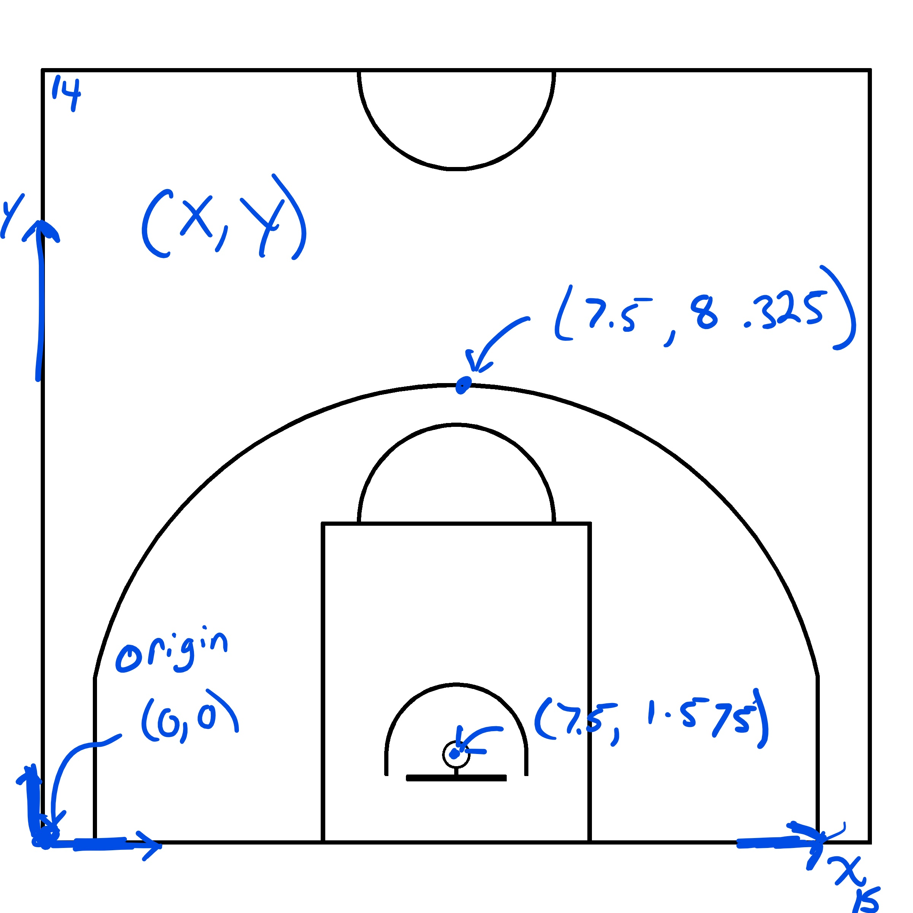
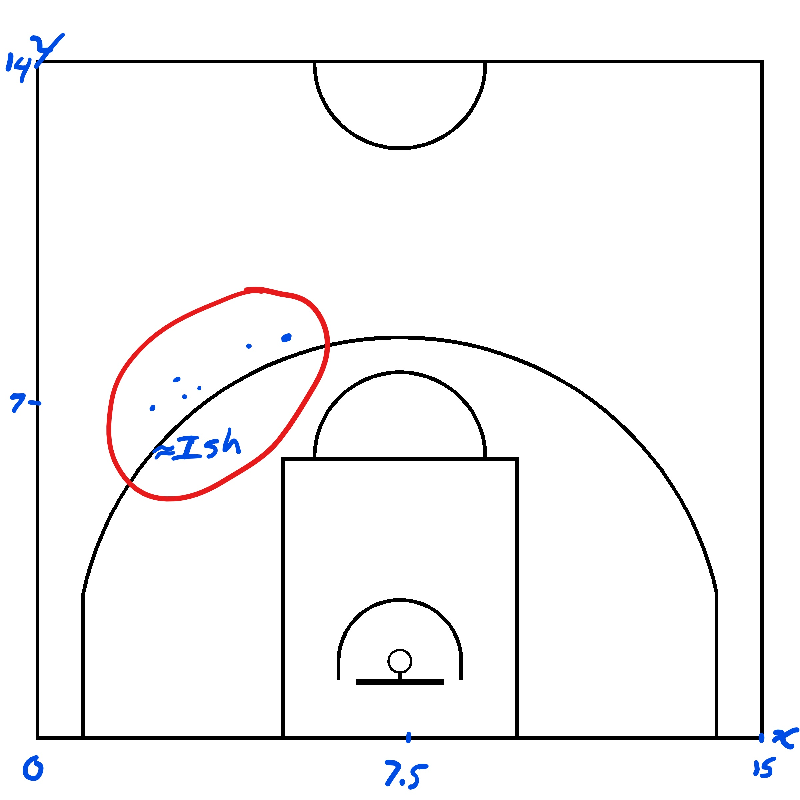
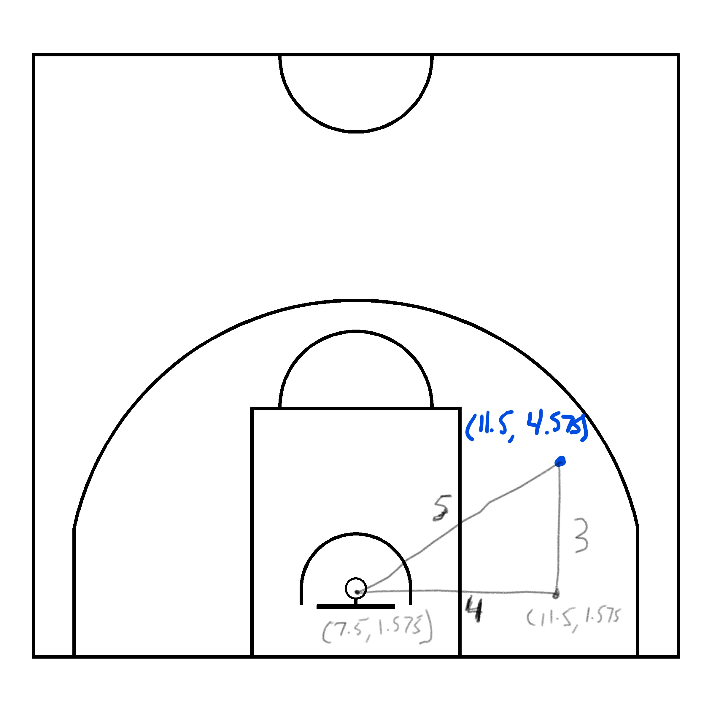
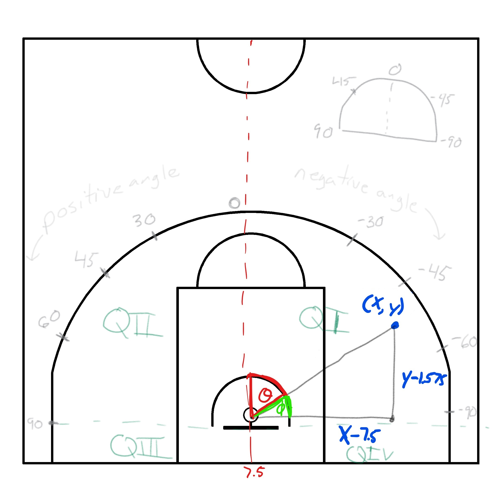

```{r setup, include=FALSE}
knitr::opts_chunk$set(echo = TRUE, message = FALSE, warning = FALSE, echo = TRUE)
```

# Exploring Basketball Shots Data {#shots-data}

__Note that all the ```R``` code used in this book is accessible on [GitHub](https://github.com/olivierchabot17/ballbook).__

## Tracking Basketball Shots

Basketball shot coordinates can be tracked manually using pen and paper. The $(x, ~y)$ coordinates of each dot could be estimated once a reference frame for the basketball court has been chosen. Let's consider a FIBA basketball court^[exact dimensions can be found [here](https://www.fiba.basketball/documents/official-basketball-rules/2020.pdf)] and focus on the half-court for now. We can set the origin of our two-dimensional coordinate system at the bottom left corner of the image below (Figure \@ref(fig:xy-court)).

```{r xy-court, echo = FALSE, fig.cap = 'Choosing our coordinate reference system (crs)', out.width='100%', fig.align='center'}

```

Once we've picked a coordinate system, then we can visually estimate the $(x, ~y)$ coordinates of each shot that was tracked on paper. Of course, this is __not ideal__. I built this [Desmos file](https://www.desmos.com/calculator/pcsvcpcwy8) in the early days to manually estimate the shot coordinates on an NBA court.

This is where the [Easy Stats](https://www.easystatsapp.com/) iOS application comes in. You can watch this [video tutorial](https://youtu.be/A4f4gioAnFg) to see how one can easily track and export more precise shot coordinates. In short, we can use the app to keep track of the shooter, the outcome of the shot (made or missed), and the location of the shot. This play-by-play data can be exported as a csv file via email.

## Getting To Know Our Data

A basic shot data set was put together for this analysis. Let's load the dataset and see what we're working with.

```{r import}
# Load the tidyverse library to be able to use %>% and dplyr to wrangle
library(tidyverse)

# Load the artificial shot data
shots <- readRDS(file = "data/shots.rds")
```

```{r first-shots, tidy=FALSE, echo = FALSE}
knitr::kable(
  head(shots), caption = 'Here are the first few shots',
  booktabs = TRUE
)
```

Table \@ref(tab:first-shots) tells us that `r shots$player[1]` made their first shot at location $(`r round(shots$loc_x[1], digits = 2)`, `r round(shots$loc_y[1], digits = 2)`)$. We can try to place this first shot on a basketball court. We know that $`r round(shots$loc_x[1], digits = 2)` < 7.5$ which implies that the shot was taken on the right side of the court^[from the players perspective looking at the rim].

```{r, shots-ish, echo = FALSE, fig.cap = 'Estimated locations of first 6 shots in the sample', out.width='100%', fig.align='center'}

```

```{r}
# Display the general structure of the data
str(shots)
```

```{r, echo = FALSE}
n_players <- length(levels(shots$player))
n_shots <- nrow(shots)
fg_pct <- mean(shots$shot_made_numeric)
```

We see from the output above that __`r n_players` distinct players__ took shots in our data set. We are working with a categorical variable (player), a binary numeric variable (made shot? yes/no), and two continuous variables for the shot coordinates.

```{r}
# Explore the distribution of each variable
summary(shots)
```

Note that 4 players took around half of the shots in the sample. This implies that some players did not take many shots. Taking the average of all the `r n_shots` ones and zeros we get that the overall shooting percentage is `r round(fg_pct*100, digits = 2)`%. The $x$ component of the location seems to stay between 0 and 15. This makes sense since the data set was created using a [FIBA](https://www.fiba.basketball/documents/official-basketball-rules/2020.pdf) sized basketball court which has a width of 15 meters and a height of 28 meters. It therefore makes sense that the highest recorded shot had a $y$ component of `r round(max(shots$loc_y), digits = 2)` meters given that the three-point is 8.325 meters from the baseline. 

## Augmenting Our Data

We need to create a FIBA basketball court in R to plot these points exactly. But first, let's add a few columns to our data. We can convert the player variable to a factor variable and reorder it's levels. We can create a factor variable for the binary outcome of whether the shot was made or not and properly label its levels. 

```{r clean}
# Add a few variables and clean others
shots <- shots %>%
  # Convert shots to a tibble format
  tibble() %>%
  # Add Columns
  mutate(
    # convert players to a factor
    player =  factor(
      player, 
      # Re-level P1, P2, ..., P18
      levels = paste("Player", 1:length(unique(shots$player)))
      ),
    # Create  a factor binary variable for whether the shot was made or not
    shot_made_factor = recode_factor(factor(shot_made_numeric),
      "0" = "Miss", 
      "1" = "Make"
      )
  )
```

```{r shot-made-factor, tidy=FALSE, echo = FALSE}
knitr::kable(
  head(shots),
  caption = 'Adding a categorical variable for the outcome of the shot',
  booktabs = TRUE
)
```

### Shot Distance

We can calculate the 2D distance between each shot^[coordinates $(x, ~y)$] and the center of the hoop^[located at $(7.5, ~1.575)$]. To do so, we can use the distance^[measured in meters] formula.

$$
d = \sqrt{(x - 7.5)^2 + (y - 1.575)^2}
$$
Note that this formula for distance works since it is essentially the [Pythagorean Theorem](https://en.wikipedia.org/wiki/Pythagorean_theorem). Consider the simplistic example of a shot located at $(11.5, ~4.575)$. You can use the formula to calculate the distance or you can see from Figure \@ref(fig:distance) below that the distance should be 5 meters by the Pythagorean Theorem.

```{r, distance, echo = FALSE, fig.cap = 'Calculating the shot distance with the Pythagorean Theorem', out.width='100%', fig.align='center'}

```

Note that FIBA uses the metric system for its court dimensions. The NBA and many basketball fans communicate distances in terms of feet. For this reason, we'll convert the distance from meters to feet with the following equivalence.

$$
d_{\mbox{feet}} = d_{\mbox{meters}} \times \left( 3.28084 ~ \frac{\mbox{ft}}{\mbox{m}} \right)
$$

```{r}
# Define FIBA court width and y-coordinate of hoop center in meters
width <- 15 
hoop_center_y <- 1.575

# Calculate the shot distances
shots <- shots %>%
  # Add Columns
  mutate(
    dist_meters = sqrt((loc_x-width/2)^2 + (loc_y-hoop_center_y)^2),
    dist_feet = dist_meters * 3.28084
  )
```

```{r dist-feet, tidy=FALSE, echo = FALSE}
knitr::kable(
  head(shots) %>% select(-shot_made_numeric, -shot_made_factor),
  caption = 'Converting the distance from meters to feet',
  booktabs = TRUE
)
```

### Shot Angle {#shots-theta}

We can also calculate the angle $\theta$ between the shot location and the center line. Looking at Figure \@ref(fig:quadrants) is almost certainly a better way to grasp how we defined the shot angle.

```{r quadrants, echo = FALSE, fig.cap = 'Reference system for the shot angle', out.width='100%', fig.align='center'}

```

The shot angle is $\theta$$[red angle]. To calculate it, we could calculate $\phi$^[green angle] and subtract it from $90^{\circ}$ or $\frac{\pi}{2}$ radians. We can use [SOH CAH TOA](https://www.mathsisfun.com/algebra/sohcahtoa.html) to calculate $\phi$. Since we have the opposite and adjacent sides to the angle $\phi$, we can use the tangent ratio ($\tan(\phi) = \frac{O}{A}$). Thus, we get that $\phi = \arctan(\frac{y - 1.575}{x - 7.5})$. Then, we have $\theta = \phi - \frac{\pi}{2}$ for the shot in the picture above. 

Note that the shot angle is negative since we defined shots on the left-hand side of the court^[from the player's perspective] to have negative angle values. Note that the calculation of the shot angle will depend on which quadrant is the shot is released from but the same logic applies. 

By default, most calculators will return angles in radians. However, most mortals don't know what a shot angle of `r 45*(pi/180)` radians^[45 degrees] means so we'll to degrees to communicate our results. We can easily convert the angles to degrees by using the following equivalence.

$$
\theta_{\mbox{degrees}} = \theta_{\mbox{radians}} \times \left( \frac{180 ~ \mbox{degrees}}{\pi ~ \mbox{radians}} \right)
$$


```{r}
# Calculate the shot angles
shots <- shots %>%
  # Add Columns
  mutate(
    theta_rad = case_when(
      # Quadrant 1: Shots from left side higher than the rim
      loc_x > width/2 & loc_y > hoop_center_y ~
        atan((loc_x-width/2)/(loc_y-hoop_center_y)),
      # Quadrant 2: Shots from right side higher than the rim
      loc_x < width/2 & loc_y > hoop_center_y ~
        atan((width/2-loc_x)/(loc_y-hoop_center_y)),
      # Quadrant 3: Shots from right side lower than the rim
      loc_x < width/2 & loc_y < hoop_center_y ~
        atan((hoop_center_y-loc_y)/(width/2-loc_x))+(pi/2),
      # Quadrant 4: Shots from left side lower than the rim
      loc_x > width/2 & loc_y < hoop_center_y ~
        atan((hoop_center_y-loc_y)/(loc_x-width/2))+(pi/2),
      # Special Cases
      loc_x == width/2  & loc_y >= hoop_center_y ~ 0, # Directly centered front
      loc_x == width/2  & loc_y < hoop_center_y ~ pi, # Directly centered back
      loc_y == hoop_center_y ~ pi/2, # Directly parallel to hoop center
    ),
    # Make the angle negative if the shot is on the left-side
    theta_rad = ifelse(loc_x > width/2, -theta_rad, theta_rad),
    # Convert the angle from radians to degrees
    theta_deg = theta_rad * (180/pi)
  )
```

```{r angle, tidy=FALSE, echo = FALSE}
knitr::kable(
  head(shots) %>% 
    select(player, dist_meters, dist_feet, theta_rad, theta_deg),
  caption = 'Adding the shot angles in both radians and degrees.',
  booktabs = TRUE
)
```

We can save our newly augmented data so we can load it in the next chapters without the need to manually add the extra columns each time.

```{r, eval = FALSE}
# Save the augmented data
saveRDS(shots, file = "data/shots_augmented.rds")
```

In the next chapter, we will start to explore how the different variables influence the probability of making a shot.

__Note that all the ```R``` code used in this book is accessible on [GitHub](https://github.com/olivierchabot17/ballbook).__