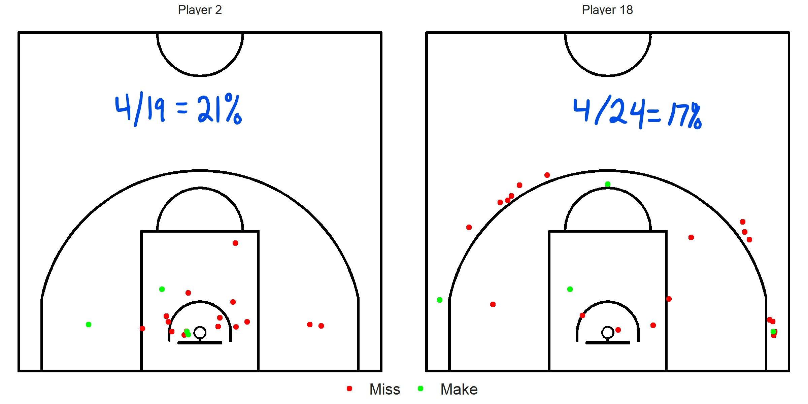

```{r setup, include=FALSE}
knitr::opts_chunk$set(echo = FALSE, message = FALSE, warning = FALSE)
```

# Modeling Basketball Shots {#model}

__Note that all the ```R``` code used in this book is accessible on [GitHub](https://github.com/olivierchabot17/ballbook).__

Shot distance and shot angle can always be calculated given shot coordinates. Interesting insights can be generated from this augmented data. Let's try to get a better understanding of how these variables affect shooting percentage. Let's load the data we created in Chapter \@ref(shots-data).

## Visusalizing our Data

### Shot Distance

We can try to visualize the relationship between shot distance^[measured in feet] and the probability of making a shot.

```{r, echo = FALSE}
# Load the tidyverse library for dplyr (wrangle) and ggplot (visualize)
library(tidyverse)
# Load the broom library to work with models
library(broom)

# Load the artificial shot data
shots <- readRDS(file = "data/shots_augmented.rds")
```

```{r fg-dist, echo = FALSE, fig.cap = 'How distance affects shooting percentage', out.width='100%', fig.align='center'}
# Restricted Area Distance from Hoop
ra_dist_ft <- 1.25*3.28084
# Three-Point Line Distance from Hoop
three_dist_ft <- 6.75*3.28084

# Create a dataframe with the label information
annotation <- data.frame(
   x = c(ra_dist_ft, three_dist_ft),
   y = c(0.1, 0.1),
   label = c("Restricted Area", "Three-Point Line")
)

# Add 2 point area versus 3 point area label at the top.
area <- data.frame(
   x = c(three_dist_ft/2, three_dist_ft + (25-three_dist_ft)/2),
   y = c(0.92, 0.92),
   label = c("Worth 2 Points", "3 Points"),
   color = c("blue", "orange")
)

# Plot shooting % versus shot distance (feet)
ggplot(data = shots, aes(x = dist_feet, y = shot_made_numeric)) +
  # Fits a red curve to our binary numeric shot_made_numeric variable
  geom_smooth(color = "red") +
  # Add a Marginal distribution plot on the x-axis to show
  # How much data we have for each distance
  geom_rug(
    aes(color = shot_made_factor), alpha = 0.1, show.legend = FALSE, 
    sides = "b")  + # only the x distribution
  # Add dashed vertical lines at the restricted area and 3pt line for reference
  geom_vline(
    xintercept = c(ra_dist_ft, three_dist_ft),
    linetype = "dashed", color = "grey") +
  # Label the vertical lines
  geom_label(
    data = annotation, aes(x = x, y = y, label = label),
    color = "grey", angle = 0, fontface = "bold") +
  # Add 2 point area versus 3 point area label at the top.
  annotate("rect", xmin = 0, xmax = three_dist_ft, ymin = 0.97, ymax = 1,
           alpha = 0.2, fill = "blue", color = "blue") +
  annotate("rect", xmin = three_dist_ft, xmax = 25, ymin = 0.97, ymax = 1,
           alpha = 0.2, fill = "orange", color = "orange") +
  geom_label(
    data = area, aes(x = x, y = y, label = label),
    color = area$color, fontface = "bold", show.legend = FALSE) +
  # Limit our graph and model for shots within 25 feet of hoop
  # The data is too sparse for further shots
  scale_x_continuous(
    limits = c(0, 25),
    breaks = seq(from = 0, to = 25, by = 5)
    ) +
  # Display the y-axis as a percentage
  scale_y_continuous(
    breaks = seq(from = 0, to = 1, by = 0.1),
    labels = scales::percent_format(accuracy = 1)) +
  # Red = Miss, Green = Make
  scale_color_manual(values = c("red", "green")) +  
  # Cleaner Graph Theme
  theme_classic() +
  # Rename the graph and axes
  labs(
    title = "Shooting Percentage Relationship with Shot Distance",
    x = "Shot Distance (feet)",
    y = "Shooting Percentage "
  )

# Save this graph
#ggsave(filename = "images/fg_dist.png", width = 8, height = 4)
```

The accuracy starts off at approximately 75% for shots at the rim and levels off at 35% for shots further than 5 feet from the hoop. That's a drop in shooting percentage of roughly __40 percentage points__ within the first five feet! Notice that the three-point shooting percentage is not much different from the mid-range accuracy. 

This plot provides evidence for the hypothesis proposed in Chapter \@ref(intro). Attempts at the rim provide more expected points per shot than any other shot attempt. This is especially true considering that attackers tend to get fouled more often by attacking the rim. 

An average team will make about 75% of their free throw attempts^[https://www.nba.com/stats/teams/traditional/?sort=W_PCT&dir=-1]. Three quarters of two points is 1.5 points which is even better than the expected points of layups sitting at $0.6 \times 2 ~\mbox{points} = 1.2$ expected points per shot. Furthermore, the average mid-range shot from our sample produced roughly $0.35 \times 2 ~\mbox{points} = 0.7$ points per shot compared to $0.35 \times 3 ~\mbox{points} = 1.05$ points per shot for the average three-point attempt. This implies that teams who evaluate their possessions through the lens of expected points should embrace the following hierarchy for possession quality:

$$
\mbox{2 or more free throws} > \mbox{lay up} > \mbox{3-pointer} > \mbox{mid-range}
$$
Of course, this strategy needs more __nuance__. Its implementation will depend on many factors such as the score of the game, who is on the court, the time remaining on the clock, and so on. Nevertheless, teams at the highest levels of the game have found success by reorienting their strategy to mirror this framework^[https://www.washingtonpost.com/sports/2020/10/19/daryl-morey-reshaped-nba-houston-rockets/].

### Shot Angle

We can also attempt to visualize  how the angle from the center line  of each shot affects shooting performance. Players often report that it is easier to shoot from the __center of the court__. [Noah Basketball](https://www.noahbasketball.com/) has also found  that players taking three-point shots from the corners tended miss systematically away from the backboard^[read the full paper [here](https://www.sloansportsconference.com/research-papers/high-resolution-shot-capture-reveals-systematic-biases-and-an-improved-method-for-shooter-evaluation)]. This bias was stronger from the right-corner which was hypothesized to have something to do with the fact that most shooters are right-handed. Refer to Section \@ref(shots-theta) to see how we defined our shot angle reference system.

```{r fg-theta, echo = FALSE, fig.cap = 'How angle affect shooting percentage', out.width='100%', fig.align='center'}
# Create a dataframe with the label information
annotation <- data.frame(
   x = c(-90, 0, 90),
   y = c(0.1, 0.1, 0.1),
   label = c("Left", "Center", "Right")
)

# Add Left-Side versus Right-Side label at the top.
side <- data.frame(
   x = c(-50, 50),
   y = c(0.92, 0.92),
   label = c("Left-Side", "Right-Side"),
   color = c("blue", "orange")
)

# Plot shooting % versus shot angle(degrees)
ggplot(
  data = shots,
  aes(x = theta_deg, y = shot_made_numeric)) +
  # Fits a red curve to our binary numeric shot_made_numeric variable
  geom_smooth(color = "red") +
  # Add a Marginal distribution plot on the x-axis to show
  # How much data we have for each angle
  geom_rug(
    aes(color = shot_made_factor), alpha = 0.1, show.legend = FALSE,
    sides = "b")  + # only the x distribution
  # Add dashed vertical lines at Left, Center, and Right for reference
  geom_vline(
    xintercept = annotation$x,
    linetype = "dashed", color = "grey") +
  # Label the vertical lines
  geom_label(
    data = annotation, aes(x = x, y = y, label = label),
    color = "grey", angle = 0, fontface = "bold") +
  # Add 2 point area versus 3 point area label at the top.
  annotate("rect", xmin = -100, xmax = 0, ymin = 0.97, ymax = 1,
           alpha = 0.2, fill = "blue", color = "blue") +
  annotate("rect", xmin = 0, xmax = 100, ymin = 0.97, ymax = 1,
           alpha = 0.2, fill = "orange", color = "orange") +
  geom_label(
    data = side, aes(x = x, y = y, label = label),
    color = side$color, fontface = "bold", show.legend = FALSE) +
  # Limit our graph and model for shots within [-100, 100] degrees
  # The data is too sparse for more angled shots
  scale_x_continuous(
    limits = c(-100, 100),
    breaks = seq(from = -100, to = 100, by = 10)
    ) +
  # Display the y-axis as a percentage
  scale_y_continuous(
    breaks = seq(from = 0, to = 1, by = 0.1),
    labels = scales::percent_format(accuracy = 1)) +
  # Red = Miss, Green = Make
  scale_color_manual(values = c("red", "green")) +
  # Cleaner Graph Theme
  theme_classic() +
  # Rename the graph and axes
  labs(
    title = "Shooting Percentage Relationship with Shot Angle",
    x = "Shot Angle (degrees)",
    y = "Shooting Percentage "
  )
```

Shots coming from the center do not seem to go in at a significantly higher rate than shots coming from the sides. There appears to be slight increase in shooting percentage as shots move from the left side to the right side of the court. However, this effect may not be robust enough to be statistically or practically significant. The rug distribution of shots located at the bottom of the graph indicates clusters at $0^{\circ}$, $45^{\circ}$, and $90^{\circ}$. This makes sense given common basketball offensive strategies. 

Keep in mind that not all shots from $90^{\circ}$ are created equal. It could be that right layups could in at a higher rate, but right corner shots go in at a lower rate. We could create separate pictures for each range of distance, but we'll see how we can control for shot distance with a statistical model^[see Section \@ref(full-model)].

The previous plot showed no obvious large differences between shooting from the left or right side of the court. We can take the absolute value of the shooting angle to essentially fold our graph in half. This allows us to narrow in on the effect of shooting angle on shooting percentage instead without differentiating between the left and right side of the court.

```{r fg-abs-theta, echo = FALSE, fig.cap = 'How the absolute value of the angle affects shooting percentage', out.width='100%', fig.align='center'}
# Create a dataframe with the label information
annotation <- data.frame(
   x = c(0, 90),
   y = c(0.1, 0.1),
   label = c("Center", "Sides")
)

# Plot shooting % versus abs(shot angle) (degrees)
ggplot(
  data = shots,
  # Take absolute value of shooting angle
  aes(x = abs(theta_deg), y = shot_made_numeric)) +
  # Fits a red curve to our binary numeric shot_made_numeric variable
  geom_smooth(color = "red") +
    # Add a Marginal distribution plot on the x-axis to show
  # How much data we have for each angle
  geom_rug(
    aes(color = shot_made_factor), alpha = 0.1, show.legend = FALSE,
    sides = "b")  + # only the x distribution
  # Add dashed vertical lines at the center and corner for reference
  geom_vline(
    xintercept = annotation$x,
    linetype = "dashed", color = "grey") +
  # Label the vertical lines
  geom_label(
    data = annotation, aes(x = x, y = y, label = label),
    color = "grey", angle = 0, fontface = "bold") +
  # Limit our graph and model for shots within [-100, 100] degrees
  # The data is too sparse for more angled shots
  scale_x_continuous(
    limits = c(0, 100),
    breaks = seq(from = 0, to = 100, by = 10)
    ) +
  # Display the y-axis as a percentage
  scale_y_continuous(
    breaks = seq(from = 0, to = 1, by = 0.1),
    labels = scales::percent_format(accuracy = 1)) +
    # Red = Miss, Green = Make
  scale_color_manual(values = c("red", "green")) +
  # Cleaner Graph Theme
  theme_classic() +
  # Rename the graph and axes
  labs(
    title = "Shooting Percentage Relationship with Angle from Center Line",
    x = "Shot Angle (degrees)",
    y = "Shooting Percentage"
  )
```

Taking the absolute value of the shooting angle reveals a different story. Shooting from the sides and center (compared to shooting from $45^{\circ}$) seemed to result in greater accuracy. Again, this could be heavily biased by layups. The relationship between shot angle and accuracy is not clear cut for our sample. More data and modeling may shed more insight.

### Player {#player-fg}

```{r, echo = FALSE}
# Calculate overall field goal percentage
fg_pct <- mean(shots$shot_made_numeric)

team_summary <- shots %>%
  group_by(player) %>%
  summarise(
    shots_made = sum(shot_made_numeric),
    shot_attempts = n(),
    fg_pct = shots_made / shot_attempts
  ) 
```

```{r fg-player, echo = FALSE, fig.cap = 'How the player affects shooting percentage', out.width='100%', fig.align='center'}
team_summary %>%
  ggplot(aes(
    x = fct_reorder(player, fg_pct, .desc = FALSE), y = fg_pct),
    color = "red") +
  geom_linerange(aes(ymin = 0, ymax = fg_pct, alpha = shot_attempts),
                 size = 2, color = "red") +
  geom_point(size = 5) +
  geom_text(aes(label = round(fg_pct*100)),
            size = 3, color = "white") +
  geom_hline(yintercept = fg_pct, linetype = "dashed", alpha = 0.4) +
  coord_flip() +
  theme_classic() +
  scale_alpha_continuous(name = "# of shots") +
  # Display the x-axis as a percentage
  scale_y_continuous(
    breaks = seq(from = 0, to = 1, by = 0.1),
    labels = scales::percent_format(accuracy = 1)) +
  labs(
    title = "Ranked Player Shooting Percentage",
    x = "", y = "Shooting Percentage")

# Save this graph
#ggsave(filename = "images/lollipop.png", width = 8, height = 4)
```

As you can see from Figure \@ref(fig:fg-player), some players shoot better than others. Strictly looking at the field goal percentages can be misleading however. What if the most accurate shooter only took easy layups? We will see how we can try to __separate shot ability from shot difficulty__ by modeling our data below or in Chapter \@ref(shot-quality).

## Quantifying these Effects

Pretty pictures are great. That said, they may struggle to display and quantify how different variables may interact. Technically, the red squiggle from `geom_smooth()` in the pictures above used a model^[Generalized Additive Model (or [GAM](https://en.wikipedia.org/wiki/Generalized_additive_model) for short). See Chapter \@ref(gam) for more on GAMs.] to predict the accuracy of the shooters for every distance. Let's try to model these effects more thoroughly.

### Logistic Regression

[Logistic regression](https://www.datacamp.com/community/tutorials/logistic-regression-R) is a machine learning tool used to model binary outcomes (made or missed shot in our case). We won't dive too deep into the modeling rabbit hole since the focus of this book is on the __spatial__ analysis of basketball shots with an emphasis on __visualizations__.

We are trying the find the average shooter's probability of making a shot given a certain distance (measured in feet). Mathematically speaking, we can write this probability as:

$$
P(X) = P(Y = \mbox{Make} ~| ~ X = \mbox{distance})
$$
We know that probabilities have to __range between zero and one__. The issue with using the classic [linear regression model](https://www.datacamp.com/community/tutorials/linear-regression-R)^[with equation $P(X) = \beta_0 + \beta_1X$] is that a straight line can give values higher than one or lower than zero^[see Figure \@ref(fig:log-lin)]. To keep our probabilities between zero and one, we can use the __logistic function__.

$$
P(X) = \frac{e^{\beta_0 + \beta_1X}}{e^{\beta_0 + \beta_1X} + 1}
$$

Note that exponentiating $\beta_0 + \beta_1X$ removes the possibility of a negative probability. We also divide a positive number by a a greater positive number to keep our output below 1 (hence the $+1$ in the denominator). 

The logistic function can be rearrange in the following way:

$$
\log \left( \frac{P(X)}{1 - P(X)} \right) = \beta_0 + \beta_1X
$$

Note that we can easily switch back and forth between the log-odds^[$\log \left( \frac{P(X)}{1 - P(X)} \right)$], the odds^[$\frac{P(X)}{1 - P(X)}$], and the probability^[$P(X)$] of making a shot given a specific distance once we calculated $\beta_0$ and $\beta_1$.

Let's fit some models in `R` using the `glm()` function with its family argument set to `binomial` to specify that we want a logistic regression model.

__Note that all the ```R``` code used in this book is accessible on [GitHub](https://github.com/olivierchabot17/ballbook).__

### Distance Logistic Regression Model  {#distance-only}

```{r, echo = TRUE}
# Fit a logistic regression model to predict the P(make|distance)
log_mod_dist <- glm(
  formula = shot_made_numeric ~ dist_feet,
  family = 'binomial', data = shots)
```

```{r log-mod-dist, tidy=FALSE, echo = FALSE}
knitr::kable(
  tidy(log_mod_dist),
  digits = 3,
  caption = 'Distance logistic model coefficients',
  booktabs = TRUE
)
```

We see that our distance variable is significant with a p-value of approximately 1 per 1000. The observed coefficient for the $X$ is $\beta_1 = `r coef(log_mod_dist)[2]`$ which implies that the log-odds of making a shot (versus missing it) decrease by `r abs(coef(log_mod_dist)[2])` for every extra foot further from the hoop. The previous sentence is very difficult to interpret. We usually __think and talk in terms of odds and probabilities__. We can also exponentiate $\beta_1$ to interpret it as an odds-ratio^[see this [article](https://stats.idre.ucla.edu/other/mult-pkg/faq/general/faq-how-do-i-interpret-odds-ratios-in-logistic-regression/) for more details on interpreting logistic regression coefficients].

```{r}
# Calculate Odds Ratios with their confidence intervals
or_table <- cbind(
  odds_ratio = exp(coef(log_mod_dist)),
  exp(confint(log_mod_dist))
)

# Reverse the odds ratio for beta_1 so it is easier to interpret
or_dist <- 1/or_table[2, 1]
```

```{r or-dist, tidy=FALSE, echo = FALSE}
knitr::kable(
  or_table,
  digits = 3,
  caption = 'Odd-ratios for the distance logistic regression model',
  booktabs = TRUE
)
```

The odds ratio for making a shot versus missing is `r or_table[2, 1]`. Let's take the reciprocal of this odds ratio so it is easier to interpret. We get $\frac{1}{`r or_table[2, 1]`} = `r or_dist`$. This implies that the odds of missing a shot (versus making it) increase by `r round((or_dist - 1)*100, digits = 2)`% for every one foot increase in distance. We can also calculate the predicted probabilities of making the shot given the distance.

```{r}
# Calculate probabilities with observed coefficients and distances
beta_0 <- coef(log_mod_dist)[1]
beta_1 <- coef(log_mod_dist)[2]
x <- shots$dist_feet 

probabilities <- (exp(beta_0 + beta_1 * x)) / (exp(beta_0 + beta_1 * x) + 1)

# Can also calculate probabilities using the fitted() function
shots$make_prob <- fitted(log_mod_dist)

# # Display some probabilities
# set.seed(123) # Always Display the same rows
# shots %>%
#   sample_n(size = 10) %>% # Show 10 random rows
#   select(player, shot_made_numeric, dist_feet, make_prob)

# Display some probabilities for the dist model
set.seed(123)
dist_prob_n <- augment(log_mod_dist, type.predict = "response") %>%
  sample_n(size = 10) %>%
  inner_join(
    shots, 
    by = c("dist_feet" = "dist_feet",
           "shot_made_numeric" = "shot_made_numeric")) %>%
  transmute(shot_made_numeric, player, dist_feet, theta_deg,
            make_prob_dist = .fitted)
```

```{r dist-prob, tidy=FALSE, echo = FALSE}
knitr::kable(
  dist_prob_n,
  digits = 3,
  caption = 'Predicted make probabilities for distance model',
  booktabs = TRUE
)
```

We see that the model assigns a lower make probability for shots further away. In fact, we can visualize the relationship between the predicted probability of the model and shot distance. We will take advantage of this graph to illustrate the difference between a linear model and logistic model.

```{r log-lin, echo = FALSE, fig.cap = 'The linear model predicts negative probabilities', out.width='100%', fig.align='center'}
# Create a sequence of numbers from 0 to 100 to feed into our models
explanatory_data <- tibble(
  dist_feet = seq(from = 0, to = 100, by = 1)
)

# Predict make prob using our logistic regression model
prediction_data_log <- explanatory_data %>%
  mutate(make_prob = predict(log_mod_dist, explanatory_data, type = "response"))

# Fit a linear regression model to predict the P(make|distance)
lin_mod_dist <- lm(formula = shot_made_numeric ~ dist_feet, data = shots)

# Predict the make prob based on linear model
prediction_data_lin <- explanatory_data %>%
  mutate(make_prob = predict(lin_mod_dist, explanatory_data))

# Join the two predictions datasets for plotting purposes
prediction_data <- inner_join(
  prediction_data_log, prediction_data_lin, 
  by = c("dist_feet" = "dist_feet"),
  suffix = c("_logistic", "_linear")) %>%
  # convert to a long data frame from plotting
  pivot_longer(-dist_feet, values_to = "make_prob", names_to = "model") %>%
  # Rename the models
  mutate(model = ifelse(model == "make_prob_logistic", "Logistic", "Linear"))

# Plot both models on the same graph
prediction_data %>%
ggplot(aes(x = dist_feet, y = make_prob, colour = model)) +
  geom_line() +
  # Add dashed lines to show the limit to our data
  geom_hline(yintercept = 0, linetype = "dashed", alpha = 0.2) +
  geom_vline(xintercept = 30, linetype = "dashed", alpha = 0.2) +
  # Cleaner theme
  theme_classic() +
  theme(legend.position = "bottom", legend.title = element_blank()) +
  scale_y_continuous(
    breaks = seq(from = -0.2, to = 0.5, by = 0.1),
    labels = scales::percent_format(accuracy = 1)) +
  labs(
    title = " Comparing Logistic and Linear Models",
    x = "Shot Distance (feet)",
    y = "Predicted Probability of Making a Shot"
  )

# Save this graph
#ggsave(filename = "images/log_vs_lin.png", width = 8, height = 4)
```

Of course, our shot data is limited to shots __within about 30 feet of the rim__. The plot was extended (up to 100 feet) to emphasize the difference between the two models. Both models predict essentially the same probability for making a shot for the first 30 feet. However, the linear model predicts negative probabilities for shots further than 80 feet or so. __A probability can never be less than zero__. This is why we go through the extra effort of working with the logistic regression. 

Since the linear model is almost identical to the logistic model for the range of our data (0-30 feet), we can look at $\beta_1$ for the linear regression model to see how an extra foot of distance affects the probability of making a shot. We have $\beta_1 = `r coef(lin_mod_dist)[2]`$ . Player's are expected to lose approximately half a percent in their probability of making a shot for every extra foot of distance. Stated another way, the shooting percentage drops about 6% for every extra ten feet of distance. This makes sense since the predicted probability of making a shot at distance zero is roughly `r round(prediction_data$make_prob[2], 2)` and it is `r round(prediction_data$make_prob[62], 2)` at the 30 feet mark. This is a drop in predicted probability of `r round(prediction_data$make_prob[2]- prediction_data$make_prob[62], 2)*100`% in 30 feet.

### Angle Logistic Regression Model   {#angle-only}

```{r, echo = TRUE}
# Fit a logistic regression model to predict the P(make|angle)
log_mod_theta <- glm(
  formula = shot_made_numeric ~ abs(theta_deg),
  family = 'binomial', data = shots)
```

```{r log-mod-theta, tidy=FALSE, echo = FALSE}
knitr::kable(
  tidy(log_mod_theta),
  digits = 3,
  caption = 'Angle logistic model coefficients',
  booktabs = TRUE
)
```

As expected from our exploratory plots, we see that the p-value for the angle coefficient is __not significant__ at 5%. There was __no clear relationship__ between the absolute value of the angle and the accuracy of the shooters. It wasn't like there was an obvious decrease or increase in accuracy as the players moved away from the center line.

The small but positive nature of the angle coefficient suggests that the log odds of making a shot slightly increase as you move away from the center. In other words, the model predicts a slight increase in shooting percentage when rotating away from the center line. This result could be tested experimentally but we can doubt this prediction given the magnitude and significance of the coefficient. Furthermore, the angle-only model does not control for distance and who's shooting the ball. We would intuitively expect the accuracy of players to be highest from the center. Additionally, there might be some left-right differences which weren't picked up by the model since we took the absolute value of the angle. More information is needed to make further inference.

### Player Logistic Regression Model

We can also try to quantify the effect of who is shooting the ball on the probability of making a shot. Naturally, we can expect the shooter to have a significant impact on whether the shot is likely to go in or not. After all, the field goal percentages of the shooters varied greatly^[refer to the lollipop chart above (Figure \@ref(fig:fg-player))].

```{r, echo = TRUE}
# Fit a logistic regression model to predict the P(make|player)
log_mod_player <- glm(
  formula = shot_made_numeric ~ player,
  family = 'binomial', data = shots)
```

```{r log-mod-player, tidy=FALSE, echo = FALSE}
knitr::kable(
  tidy(log_mod_player),
  digits = 3,
  caption = 'Player logistic model coefficients',
  booktabs = TRUE
)
```

Notice how the intercept coefficient is set to Player 1 by default. As a result, all players are compared to Player 1. This just happens to be relevant since Player 1's field goal percentage is `r round((team_summary %>% filter(player == "Player 1") %>% pull(fg_pct))*100, digits = 2)`% which is close to the team average of `r round(fg_pct*100, digits = 2)`%. In other words, the model is comparing each player's shooting percentage to roughly the team average.
The only statistically significant coefficient is for Player 18. This is not surprising considering the dismal `r round((team_summary %>% filter(player == "Player 18") %>% pull(fg_pct))*100, digits = 2)` shooting percentage of Player 18. 

We can fit a logistic model __with no intercept__ to get the log odds of each player to make a shot. Once that's done, we can easily convert the log odds into odds and probabilities.

```{r, echo = TRUE}
# The +0 is to remove the intercept
player_no_int <- glm(
  formula = shot_made_numeric ~ player + 0,
  family = 'binomial', data = shots) %>%
  tidy() %>%
  # Calculate the log odds, odds, and probabilities
  transmute(
    player = substring(term, 7),
    log_odds = estimate,
    odds = exp(log_odds),
    make_prob = odds / (1 + odds)
  )
```

```{r player-no-int, tidy=FALSE, echo = FALSE}
knitr::kable(
  player_no_int,
  digits = 3,
  caption = 'No-intercept player logistic model coefficients',
  booktabs = TRUE
)
```

Note that the predicted  `make_prob` column is identical to the field goal percentage of each player^[see Figure \@ref(fig:fg-player)]. The model is essentially using field goal percentages to predict whether a shot will go in or not. Of course, the technique is not ideal since not all shots are created equal. Maybe the player with low shooting percentages have been taking some tough three pointers and vice versa. Using strictly their field goal percentage to predict their probability of making a layup is obviously a flawed approach.

### The Full Model {#full-model}

Let's try to create a __full model__ to try to predict the probability of making a shot given:

1. Shot distance
2. Angle relative to the center of the court
3. Player who took the shot

```{r full_model}
# Fit a logistic full model to predict the P(make|player&dist&angle)
full_model <- glm(
  formula = shot_made_numeric ~ dist_feet + theta_deg + player + 0,
  family = 'binomial', data = shots)

# View the coefficients and other useful information about the fit of the model
summary(full_model)
```

Let's try to interpret some of these coefficients. As expected, the __distance__ coefficient is significant and the log odds of making a shot decrease by `r abs(tidy(full_model)$estimate[1])` for every additional foot away from the basket. This effect is almost identical to the effect observed earlier for the distance-only logistic regression model^[See Section \@ref(distance-only)]. 

The same is true for the __angle__ coefficient. It very similar to the coefficent of the angle-only model. It is not significant at 5% but is significant at 10%.

Now let's look at the estimates for the __players__. We see that some players have negative coefficients^[decrease in log odds of making a shot] while others have positive coefficients. We can sort the players by their predicted probability of making a shot to get a better understanding of their coefficients.

```{r, echo = FALSE}
full_prob <- tidy(full_model) %>% 
  # Only keep the terms that include the string "player" in their name
  filter(grepl("player", term)) %>%
  # Remove the first 6 characters
  mutate(player = substring(term, 7)) %>%
  # Add the field goal pct column from the team_summary tibble
  inner_join(team_summary, by = c("player" = "player")) %>%
  # Sort by make_prob (best to worst)
  arrange(desc(estimate)) %>%
  transmute(
    player, 
    log_odds = estimate,
    odds = exp(log_odds),
    make_prob = odds / (1 + odds),
    real_fg = fg_pct,
    diff = make_prob - real_fg,
    p_value = p.value,
    significant = ifelse(p_value < 0.05, TRUE, FALSE)
  )
```

```{r player-coef, tidy=FALSE, echo = FALSE}
knitr::kable(
  full_prob,
  digits = 3,
  caption = 'Interpreting the player coefficients for the full model',
  booktabs = TRUE
)
```

We see that players with a predicted probability of a made shot above 50% have positive coefficients. Another interesting thing to note is that the predicted probability of making a shot for a specific player is not the same as their overall field goal percentage. This was the case for the angle-only logistic regression model^[See Section \@ref(angle-only)]. In fact the predicted probabilities are __consistently higher__ than the actual field goal percentages. This makes sense since the full model is trying to isolate the player's shooting ability independent of the location of their shots while the player-only model only considered the name of the player and not where they were shooting from.

The only players with significant coefficients are Player 3, Player 18, and Player 2. This implies that these players are shooting worse than the others __independent of where they're shooting from__. Player 17's coefficient is almost significant at 5% which gives us some evidence that they are shooting better than others independent of shot location.Some honorable mentions in terms of significance could go to Player 4 (good), Player 14(good), and Player 8 (bad).

Take a look at the bottom two rows of Table\@ref(tab:player-coef). It is worth noting that the model predicted Player 2 to be a worse shooter than Player 18 although Player 2 had a higher field goal percentage^[see Figure \@ref(fig:fg-player)]. The reason for this becomes evident once we compare their shot charts.

```{r, eval = FALSE, echo = FALSE}
plot_court() +
  geom_sf(
    data = shots_sf %>% filter(player %in% c("Player 2", "Player 18")),
    aes(color = shot_made_factor)) +
  facet_wrap(~player) +
  # Red = Miss, Green = Make
  scale_color_manual(values = c("red", "green")) +
  theme(legend.title = element_blank())

# ggsave(filename = "p8_vs_p2.png", width = 8, height = 4)
```

```{r, echo=FALSE, out.width="100%"}

```

Player 18 is taking harder shots than Player 2. Therefore, when controlling for distance and angle, the model predicts that Player 18 is better shooter despite the lower field goal percentage.

```{r, echo = FALSE}
# Display some probabilities for the full model
set.seed(123) # Always Display the same rows

tb_full <- augment(full_model, type.predict = "response") %>%
  sample_n(size = 10) %>%
  transmute(shot_made_numeric, player, dist_feet, theta_deg,
            make_prob_full = .fitted)

# Display some probabilities for the dist model
set.seed(123)
tb_dist <- augment(log_mod_dist, type.predict = "response") %>%
  sample_n(size = 10) %>%
  inner_join(
    shots, 
    by = c("dist_feet" = "dist_feet", "shot_made_numeric" = "shot_made_numeric")) %>%
  transmute(shot_made_numeric, player, dist_feet, theta_deg,
            make_prob_dist = .fitted)

# Join them to show them both in the same tibble
dist_vs_full <- inner_join(
  tb_full, tb_dist,
  by = c("dist_feet" = "dist_feet", "shot_made_numeric" = "shot_made_numeric",
         "player" = "player", "theta_deg" = "theta_deg")
) %>%
  transmute(player, dist_feet, theta_deg, make_prob_dist, make_prob_full,
            outcome = shot_made_numeric)
```

```{r dist-full, tidy=FALSE, echo = FALSE}
knitr::kable(
  dist_vs_full,
  digits = 3,
  caption = 'Comparing the predictions of the distance-only model to the full model',
  booktabs = TRUE
)
```

Lastly, Table \@ref(tab:dist-full) compares the predictions of the distance-only model to the predictions of the full model. We can see that the full model has some predictions which are over 50% which isn't the case for the distance model. In row 2 and 4, the distance model assigns a probability of 48% to both player of making the lay up while the full model gives the edge to Player 13 over Player 17.

## Closing Thoughts

We barely scratched the surface of what is possible to do when modeling basketball shots. The aim of this chapter was twofold. First, it was meant to serve as an introduction to the key ideas and techniques of statistical modeling. Second, this chapter was designed to build some intuition about what constitutes a "good" shot attempt in basketball. This intuition will be vital to carry out the spatial analysis in the coming chapters.

The next chapter will explore how we can use the predicted probabilities from our logistic regression models to try to predict whether shots will go in or not. 

__Note that all the ```R``` code used in this book is accessible on [GitHub](https://github.com/olivierchabot17/ballbook).__