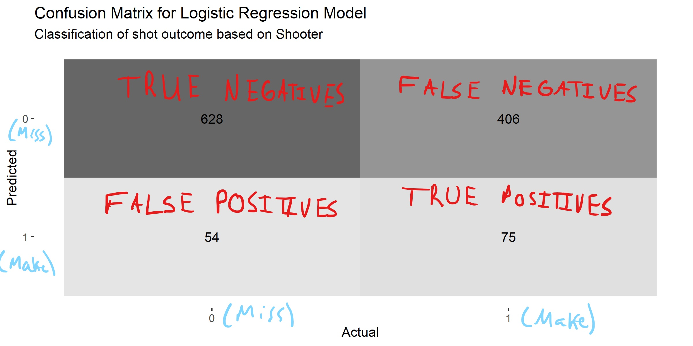

```{r setup, include=FALSE}
knitr::opts_chunk$set(echo = FALSE, message = FALSE, warning = FALSE)
```

# Classification of Basketball Shots {#classify}

__Note that all the ```R``` code used in this book is accessible on [GitHub](https://github.com/olivierchabot17/ballbook).__

A sensible thing to do with basketball shot data is to try to guess^[classification is a fancy word for an educated guess] which shots are going to go in. 

## No Information

Let's say we know nothing about a basketball shot. We don't know who is shooting and from where, nor do we know the overall field goal percentage. The only thing we can do with zero information is to give an equal chance to both outcomes. In Bayesian statistics, this is the simplest __non-informative prior__ or often reffered to as the [Principle of Indifference](https://en.wikipedia.org/wiki/Principle_of_indifference). Note that [frequentists](https://www.probabilisticworld.com/frequentist-bayesian-approaches-inferential-statistics/) don't think it makes sense to ask about the probability of a single event occurring without thinking of the long-term relative frequencies^[overall field goal percentage in our case]. 

Nevertheless, let's see how accurate it is to randomly classify half of the shots as makes and the other half as misses. This will serve as our baseline to see if we can improve on this accuracy by adding more information.

```{r tree-null, echo = FALSE, fig.cap = 'Flipping a coin to see which shots are going in', out.width='100%', fig.align='center'}

```

We can create a tree diagram like the one above to theoretically figure out that we can expect to classify somewhere around 50% of the shots correctly if we were to guess at random. We can also verify this result experimentally with a simulation.

```{r}
# Load the tidyverse library for dplyr (wrangle) and ggplot (visualize)
library(tidyverse)

# Load the artificial shot data
shots <- readRDS(file = "data/shots_augmented.rds")
```

```{r, eval = FALSE, echo = TRUE}
# Number of replications
B <- 500

# Create an empty vector to store the accuracies of each replication
accuracies <- vector(length = B)

# Create a vector for whether the shots actually went it
actual_response <- shots$shot_made_numeric

# Set the seed to ensure reproducibility
set.seed(2021)

# Perform Simulation
for(i in 1:B){
  # Randomly generate 1s and 0s based on equal 50-50 probabilities
  predicted_response <- sample(
  x = c(0, 1), size = nrow(shots), replace = TRUE,
  prob = c(
    0.5, # Miss probability
    0.5) # Make probability
  )
  
  accuracies[i] <- (table(predicted_response, actual_response)[1, 1] +
     table(predicted_response, actual_response)[2, 2]) /
    length(actual_response)
}
```

```{r, eval = FALSE}
# Create a histogram of predicted make probabilities
ggplot(data = as.data.frame(accuracies), aes(x = accuracies)) +
  geom_histogram(binwidth = 0.01, alpha = 0.6) +
  geom_vline(xintercept = 0.5, linetype = "dashed") +
  theme_classic() +
  scale_x_continuous(
    breaks = seq(from = 0.455, to = 0.60, by = 0.01),
    labels = scales::percent_format(accuracy = 0.5)) +
  labs(
    title = "Base Classification Accuracy for 500 Replications",
    x = "Accuracy"
  )

#ggsave(filename = "base_hist.png", width = 8, height = 4)
```

```{r base-hist, echo = FALSE, fig.cap = 'The simulation accuracy hovered around 50%', out.width='100%', fig.align='center'}

```

We essentially flipped a coin to decide whether each of the `r nrow(shots)` shots were going to go in or not and kept track of how many times we were right^[$\mbox{classification accuracy} = \frac{\mbox{# of times we guess right}}{\mbox{# of guesses}}$]. Then, we repeated this process 500 times. We see that the empirical accuracy did indeed hover around the theoretical accuracy of 50%.

## Overall Field Goal Percentage

```{r, echo = FALSE}
# Calculate overall field goal percentage
fg_pct <- mean(shots$shot_made_numeric)

# Make Probability
p <- fg_pct
# Miss Probability
q <- 1 - p

# Expected accuracy of predicted
coin_accuracy <- p*p + q*q
```

If we knew the overall field goal percentage of the sample, then we could use a slightly more informed approach. We could flip a weighted coin that had a `r round(fg_pct*100, digits = 2)`% chance of landing heads (make) and a `r round(q*100, digits = 2)`% chance of landing tails (miss), then we can expect to predict about `r round(coin_accuracy*100, digits = 2)`% of the shots correctly. This result can be verified experimentally by running a simulation and theoretically by building a tree diagram like the one below.

```{r tree-weighted, echo = FALSE, fig.cap = 'Using a weighted coin to predict shot outcomes', out.width='100%', fig.align='center'}

```

```{r, eval=FALSE}
# Number of replications
B <- 500

# Create an empty vector to store the accuracies of each replication
accuracies <- vector(length = B)

# Set the seed to ensure reproducibility
set.seed(2021)

# Perform Simulation
for(i in 1:B){
  # Randomly generate 1s and 0s based on overall shooting % of the sample
  predicted_response <- sum(sample(
  x = c(0, 1), size = nrow(shots), replace = TRUE,
  prob = c(
    1 - mean(shots$shot_made_numeric), # Miss probability
    mean(shots$shot_made_numeric)) # Make probability
  ))
  
  accuracies[i] <- (table(predicted_response, actual_response)[1, 1] +
     table(predicted_response, actual_response)[2, 2]) /
    length(actual_response)
}

# Display the overall accuracy of the weighted coin over the B replications
mean(accuracies)
```

This means that knowing the overall field goal percentage in the sample helps us predict the outcome of the shot about an extra `r round((coin_accuracy - 0.5)*100, digits = 2)`% of the time (`r round(coin_accuracy*100, digits = 2)` - 50). This is a __slight improvement__. However, knowing the individual player's shooting percentages may be more predictive.

## Shooter

Since we already calculated the field goal percentages of each player in Chapter \@ref(model), it's simple to predict whether the shot will go in or not. A common approach is to say that the shot will go in if the predicted probability is greater than 50%.

$$P(X) = P(Y = \mbox{Make} ~| ~ X = \mbox{shooter})> 0.5$$

This should make sense intuitively. If you had to bet on whether a given shot goes in or not, the first thing you would try to figure out is whether the player is more likely to make it or not. We can naively adopt this approach.

The results of our classification can be summarized in a confusion matrix like the one below.

```{r}
# Fit a logistic regression model to predict the P(make|player)
log_mod_player <- glm(
  formula = shot_made_numeric ~ player + 0,
  family = 'binomial', data = shots)

# Compare the actual response to the predicted response (make_prob > 0.5)
actual_response <- shots$shot_made_numeric
predicted_response <- ifelse(fitted(log_mod_player) > 0.5, 1, 0)

# Load the yardstick library to work with our confusion matrix
library(yardstick)

# Create confusion matrix object
confusion <- conf_mat(table(predicted_response, actual_response))
```

```{r, eval = FALSE}
# We can visualize the confusion matrix
autoplot(confusion, type = "heatmap") +
  labs(
    title = "Confusion Matrix for Logistic Regression Model",
    subtitle = "Classification of shot outcome based on Shooter",
    x = "Actual",
    y = "Predicted"
  )

# Save the graph
#ggsave(filename = "images/conf_mat_player.png", width = 8, height = 4)
```

```{r confusion-player, echo = FALSE, fig.cap = 'Deconfusing the confusion matrix', out.width='100%', fig.align='center'}

```

```{r}
# Get the accuracy, specificity, and sensitivity
conf_sum <- summary(confusion, event_level = "second")[c(1, 3, 4), c(1, 3)]

player_accuracy <- conf_sum$.estimate[1]
```

```{r player-metrics, tidy=FALSE, echo = FALSE}
knitr::kable(
  conf_sum,
  digits = 3,
  caption = 'Summary statistics for player-only classification attempt',
  booktabs = TRUE
)
```

We see that simply knowing who shot the ball can improve our accuracy to `r round(player_accuracy*100, digits = 2)`%. This is a significant improvement from 50% and `r round(coin_accuracy*100, digits = 2)`%. 

> However, this improved accuracy needs to be contrasted with the fact that predicting that every shot will miss gives us an accuracy of `r 100-round(fg_pct*100, digits = 2)`%. 

Thus, our model does only slightly better than predicting all misses. It correctly predicts makes only `r round(conf_sum$.estimate[2]*100, digits = 2)`% of the time and correctly predicts misses `r round(conf_sum$.estimate[3]*100, digits = 2)`% of the time^[low sensitivity and high specificity]. A rule of thumb is that we want both the sensitivity and specificity to be above 80%.

We can look under the hood to see why this is happening. Only three players make over 50% of their attempts^[See section \@ref(player-fg)]. As a result, the model predicts that all of their shots are going to go in and everyone else's shots are going to miss. This explains why there are only 75 true positives and 406 false negatives. 

We could try to lower the positive prediction threshold to increase the number of predicted makes. Let's say that everyone who shoots better than the team average (`r round(fg_pct*100, digits = 2)`%) will be predicted to make their shots and everyone who shoots worse than the average will miss.

```{r conf-player-lower, echo = FALSE, fig.cap = 'Lowering the bar from 50% to the the team average of 41.36%', out.width='100%', fig.align='center'}
# Compare the actual response to the predicted response (make_prob > 0.5)
actual_response <- shots$shot_made_numeric
predicted_response <- ifelse(fitted(log_mod_player) > p, 1, 0)

# Create confusion matrix object
confusion <- conf_mat(table(predicted_response, actual_response))

# We can visualize the confusion matrix
autoplot(confusion, type = "heatmap") +
  labs(
    title = "Confusion Matrix for Logistic Regression Model",
    subtitle = "Classification of shot outcome based on Shooter",
    x = "Actual",
    y = "Predicted"
  )

# Get the accuracy, specificity, and sensitivity
conf_sum <- summary(confusion, event_level = "second")[c(1, 3, 4), c(1, 3)]
```

```{r player-metrics-lower, tidy=FALSE, echo = FALSE}
knitr::kable(
  conf_sum,
  digits = 3,
  caption = 'Player-only classification attempt with lower threshold',
  booktabs = TRUE
)
```

We see that the accuracy of the model dropped slightly. Furthermore, the sensitivity increased significantly at the expense of the specificity. Only knowing who shot the ball is better than nothing but there's a __ton of room for improvement__.

## Shot Angle

Let's try to see how effective knowing the angle from the center line is at classifying shots in our sample.

```{r hist-angle, echo = FALSE, fig.cap = 'All predicted probabilities are below 50%', out.width='100%', fig.align='center'}
# Fit a logistic regression model to predict the P(make|angle)
log_mod_theta <- glm(
  formula = shot_made_numeric ~ abs(theta_deg),
  family = 'binomial', data = shots)

# Compare the actual response to the predicted response (make_prob > 0.5)
actual_response <- shots$shot_made_numeric
predicted_response <- ifelse(fitted(log_mod_theta) > 0.5, 1, 0)

# Create and display a confusion matrix
confusion <- table(predicted_response, actual_response)

# Calculate classification accuracy of our theta model
angle_accuracy <- confusion[1, 1] / (confusion[1, 1] + confusion[1, 2])

# Show the distribution of predicted probability.
hist(fitted(log_mod_theta), 
     main = "Histogram of predicted probabilities for angle-only model",
     xlab = " Predicted Probability")
```

The classification accuracy of the angle-only model is `r round(angle_accuracy*100, digits = 2)`%. This seems decent at first glance but the confusion matrix reveals that it predicted that __all shots were going to miss__. We saw in the previous chapter that there was no clear relationship between the angle from the center and the probability of making the shot. Thus, we won't investigate this model further.

## Shot Distance

Using the distance-only model will initially give the same result as the angle-only model. This is easy to see since even a shot at the rim (distance = 0) results in a probability of less than 50%.

```{r}
# Fit a logistic regression model to predict the P(make|distance)
log_mod_dist <- glm(
  formula = shot_made_numeric ~ dist_feet,
  family = 'binomial', data = shots)

# Calculate the highest make probability predicted by the model
max_make_prob <- exp(coef(log_mod_dist)[1]) / (exp(coef(log_mod_dist)[1]) + 1)
```

$$
P(Y = \mbox{Make} ~| ~ X = 0)= \frac{e^{\beta_0 + \beta_1 (0)}}{e^{\beta_0 + \beta_1(0)} + 1} = \frac{e^{\beta_0}}{e^{\beta_0} + 1} = \frac{e^{`r coef(log_mod_dist)[1]`}}{e^{`r coef(log_mod_dist)[1]`} + 1} \approx `r round(max_make_prob, digits = 3)`
$$
We saw that the predicted probabilities dropped roughly linearly for the range of our sample^[0-30 feet (refer to Chapter \@ref(shots-data))]. We can inspect the distribution of predictions to decide on a better threshold than 50%.

```{r hist-dist, echo = FALSE, fig.cap = 'All predicted probabilities are also below 50%', out.width='100%', fig.align='center'}
# Create a 1 column tibble to use ggplot to plt the histogram
pred_tb <- tibble(make_prob = fitted(log_mod_dist))

# Create a histogram of predicted make probabilities
ggplot(data = pred_tb, aes(x = make_prob)) +
  geom_histogram() +
  geom_vline(xintercept = fg_pct, linetype = "dashed", alpha = 0.2) +
  theme_classic() +
  scale_x_continuous(labels = scales::percent_format(accuracy = 1)) +
  labs(
    title = "Distribution of Predicted Make Probabilities",
    subtitle = "Logistic Regression Model (Y ~ Distance)",
    x = "Predicted Make Probability Given Distance"
  )
``` 

We see that the model __never__ predicts that the shot is going to go in if $P(X)$ needs to be greater than 50%. The overall shooting percentage in the sample is `r round(fg_pct*100, digits = 2)`%. Thus, if we knew nothing about the location of the shot, it would make sense to bet on the player not making the shot based on the overall shooting percentage being less than 50%. 

```{r, echo = FALSE}
# Fit a linear regression model to predict the P(make|distance)
lin_mod_dist <- lm(formula = shot_made_numeric ~ dist_feet, data = shots)

dist_threshold <- round((fg_pct - coef(lin_mod_dist)[1]) / (coef(lin_mod_dist)[2]))
```

Most predicted make probabilities are between 35% and 50% and there seems to be a __bimodal distribution__ of probabilities. This is almost certainly explained by the fact that the shot distances also had a bimodal distribution with most shots near the rim and at the three-point line ^[see Chapter \@ref(model)]. 

We can try to classify shots with a threshold of `r round(fg_pct*100, digits = 2)`% instead of 50%. This would roughly be the same as predicting that all shots further than `r dist_threshold` feet away are going to miss while any attempt closer than this distance will make it.

```{r}
# Compare the actual response to the predicted response (make_prob > 0.4)
predicted_response <- ifelse(fitted(log_mod_dist) > fg_pct, 1, 0)

# Display confusion matrix
conf <- table(predicted_response, actual_response)

#distance_accuracy <- (conf[1, 1] + conf[2, 2]) / nrow(shots)
distance_accuracy <- 1-fg_pct
```

```{r conf-dist-lower, echo = FALSE, fig.cap = 'Lowering the bar from 50% to the the team average of 41.36%', out.width='100%', fig.align='center'}
# Create confusion matrix object
confusion <- conf_mat(table(predicted_response, actual_response))

# We can visualize the confusion matrix
autoplot(confusion, type = "heatmap") +
  labs(
    title = "Confusion Matrix for Logistic Regression Model",
    subtitle = "Classification of shot outcome based on distance",
    x = "Actual",
    y = "Predicted"
  )

# Get the accuracy, specificity, and sensitivity
conf_sum <- summary(confusion, event_level = "second")[c(1, 3, 4), c(1, 3)]
```

```{r dist-metrics-lower, tidy=FALSE, echo = FALSE}
knitr::kable(
  conf_sum,
  digits = 3,
  caption = 'Distance-only classification attempt with lower threshold',
  booktabs = TRUE
)
```

Of course, this classification approach is __very limited__. Our distance logistic regression model was able to correctly predict the outcome of `r round(distance_accuracy*100, digits = 2)`% of the shots in our sample. Is this impressive? It is better than flipping a coin but worse than predicting that all shots were going to miss. 

## Knowing All Three

Finally, let's use all the information we have available to try to accurately classify shots as makes or misses. We will use the full logistic model with distance, angle, and player^[see Section \@ref(full-model)].

```{r conf-full, echo = FALSE, fig.cap = 'Classification results for the full model', out.width='100%', fig.align='center'}
# Fit a logistic full model to predict the P(make|player&dist&angle)
full_model <- glm(
  formula = shot_made_numeric ~ dist_feet + theta_deg + player + 0,
  family = 'binomial', data = shots)

# Compare the actual response to the predicted response (make_prob > 0.5)
actual_response <- shots$shot_made_numeric
predicted_response <- ifelse(fitted(full_model) > 0.5, 1, 0)

# Create confusion matrix object
confusion <- conf_mat(table(predicted_response, actual_response))

# We can visualize the confusion matrix
autoplot(confusion, type = "heatmap") +
  labs(
    title = "Confusion Matrix for Full Model",
    subtitle = "Classification of shot outcome based on Shooter, Distance, and Angle",
    x = "Actual",
    y = "Predicted"
  )

# Get the accuracy, specificity, and sensitivity
conf_sum <- summary(confusion, event_level = "second")[c(1, 3, 4), c(1, 3)]

full_accuracy <- conf_sum$.estimate[1]
```

```{r full-metrics, tidy=FALSE, echo = FALSE}
knitr::kable(
  conf_sum,
  digits = 3,
  caption = 'Full model classification metrics',
  booktabs = TRUE
)
```

We see that the full model has a classification accuracy of `r round(full_accuracy*100, digits =2)`%. We could try to improve this by lowering or increasing the 50% threshold but the default value seems reasonable based on Figure \@ref(fig:hist-full) below. 

```{r hist-full, echo = FALSE, fig.cap = 'A significant proportion of shots have a predicted probability above 50%', out.width='100%', fig.align='center'}
# Create a 1 column tibble to use ggplot to plot the histogram
pred_tb <- tibble(make_prob = fitted(full_model))

# Create a histogram of predicted make probabilities
ggplot(data = pred_tb, aes(x = make_prob)) +
  geom_histogram() +
  geom_vline(xintercept = 0.5, linetype = "dashed", alpha = 0.2) +
  theme_classic() +
  scale_x_continuous(labels = scales::percent_format(accuracy = 1)) +
  labs(
    title = "Distribution of Predicted Make Probabilities",
    subtitle = "Logistic Regression Model (Y ~ Player + Distance + Angle)",
    x = "Predicted Make Probability"
  )
``` 


## Closing Thoughts

We saw that we could correctly predict the outcome of a basketball shot about 50% of the time if we flipped a fair coin. Knowing the overall field goal percentage of the sample allowed us to make slightly better predictions with an accuracy of `r round(coin_accuracy*100, digits = 2)`%. We would have been correct `r round((1-fg_pct)*100, digits = 2)`% of the time if we predicted that all shots were going to miss. Knowing who shot the ball had an accuracy of `r round(player_accuracy*100, digits = 2)`%. Only knowing the shot distance resulted in an accuracy of `r round(distance_accuracy*100, digits = 2)`% (predicted all misses). The same was true about only considering the shot angle. Lastly, using all the information available resulted in a classification accuracy of `r round(full_accuracy*100, digits = 2)`%. We can summarize the results in Table \@ref(tab:class-summary) below.

```{r class-summary, tidy=FALSE, echo = FALSE}
# Compare Classification Accuracies
class_summary <- tibble(
  avail_info = c(
    "None",
    "Overall FG%",
    "Individual FG%",
    "Shot Angle",
    "Shot Distance",
    "All"
  ),
  accuracy = scales::percent(c(
    0.5,
    coin_accuracy,
    player_accuracy,
    angle_accuracy,
    distance_accuracy,
    full_accuracy
  ))
)

knitr::kable(
  class_summary,
  col.names = c("Available Information", "Accuracy"),
  digits = 2,
  caption = 'Comparing the different classification approaches',
  booktabs = TRUE
)
```

Knowing the individual players' field goal percentages was the most potent information when it came to predicting the outcome of each shot in our sample. The long-term shooting percentages are almost never known in advance which is where the other information such as the distance from the hoop distance and the angle from the center can come in handy. A slight increase in classification accuracy may not have a drastic impact in terms of playing strategy, but it can have immediate applications to sports gambling for example or long term predictions. 

One can imagine that adding other variables such as the distance from the shooter to the closest defender, the player's speed prior to the shot, whether the shot was off the dribble or not, and the time on the shot clock could help incrementally raise the accuracy of our predictions. Having access to the initial conditions of each shot could one day classify shots in a near deterministic fashion.

Now that we've got acquainted with our data and a general modeling framework, let's try to build a [FIBA](https://www.fiba.basketball/documents/official-basketball-rules/2020.pdf) basketball court in `R` using the [`sf`](https://r-spatial.github.io/sf/) package.

__Note that all the ```R``` code used in this book is accessible on [GitHub](https://github.com/olivierchabot17/ballbook).__