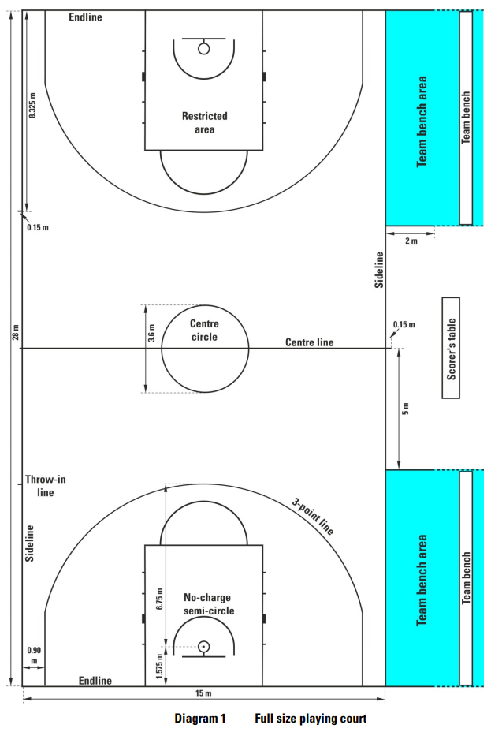
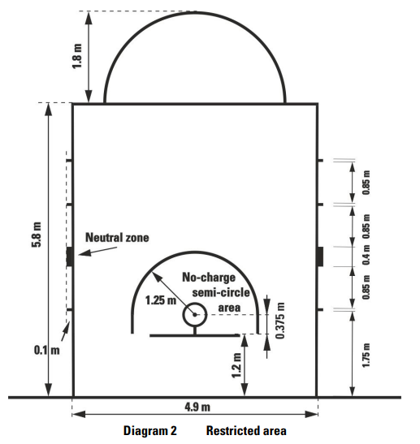
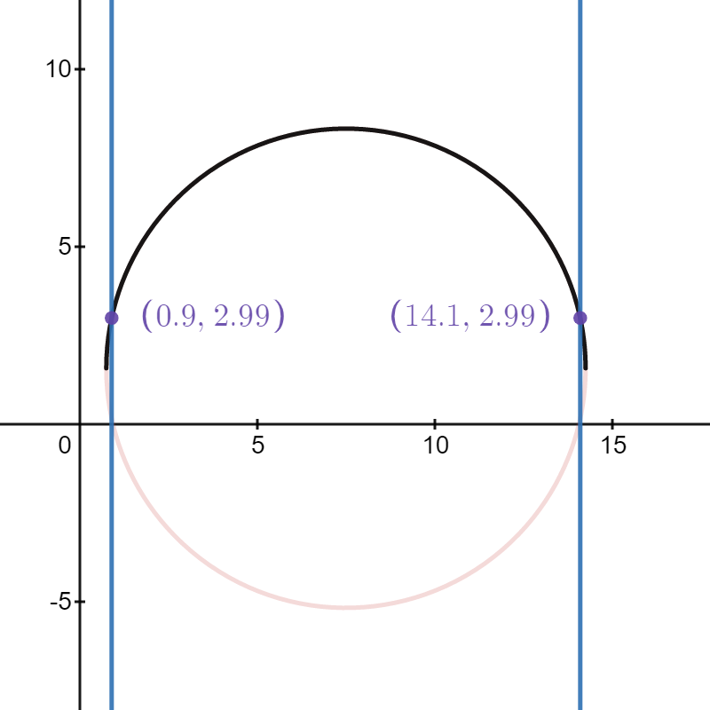

```{r setup, include=FALSE}
knitr::opts_chunk$set(echo = TRUE, message = FALSE, warning = FALSE)
```

# Building a Basketball Court in `R` {#court}

__Note that all the ```R``` code used in this book is accessible on [GitHub](https://github.com/olivierchabot17/ballbook).__

We chose to use the [`sf`](https://r-spatial.github.io/sf/) package to plot a basketball court instead of simply using [`ggplot2`](https://ggplot2.tidyverse.org/) because the `sf` was built to work with polygons and spatial data. The two packages work hand in hand. First, we'll use `sf` to generate the court points based on the FIBA court [dimensions](https://www.fiba.basketball/documents/official-basketball-rules/2020.pdf)^[this [link](https://www.fiba.basketball/documents/BasketballEquipment.pdf) may also be useful]. Second, we'll write the `plot_court()` function to easily plot a basketball court using [`ggplot2`](https://ggplot2.tidyverse.org/) moving forward. This chapter was heavily influenced by Todd W. Schneider's [Ballr](https://toddwschneider.com/posts/ballr-interactive-nba-shot-charts-with-r-and-shiny/) Shiny app.

## Generating the Court Points

### Official Dimensions

Let's use these two images taken from an official FIBA [document](https://www.fiba.basketball/documents/official-basketball-rules/2020.pdf) to get some basic dimensions. Note that all lengths are measured in meters.

```{r fiba-full, echo = FALSE, fig.cap = 'Full FIBA court dimensions', out.width='100%', fig.align='center'}

```

```{r fiba-key, echo = FALSE, fig.cap = 'FIBA court key dimensions', out.width='100%', fig.align='center'}

```

```{r}
# Load the libraries
library(sf) # Work with polygons
library(tidyverse) # ggplot2 and dplyr 

# Load some predefined court themes for the plot_court() functions
# Code found at https://github.com/olivierchabot17/ballbook
source("code/court_themes.R")

# All lengths will be in meters
line_thick = 0.05
width = 15
height = 28 / 2
key_height = 5.8
key_width = 4.9
key_radius = 1.8
backboard_width = 1.8
# https://www.fiba.basketball/documents/BasketballEquipment.pdf
backboard_thick = 0.1
backboard_offset = 1.2
hoop_radius = 0.45 / 2
hoop_center_y = 1.575
rim_thick = 0.02
neck_length = hoop_center_y - (backboard_offset + hoop_radius + rim_thick)
three_point_radius = 6.75
three_point_side_offset = 0.9
three_point_side_height = sqrt(
  three_point_radius^2 - (three_point_side_offset - width/2)^2
  ) + hoop_center_y
restricted_area_radius = 1.25
```

### Half-Court

Once we have defined a few basic dimensions, we can proceed to create polygons for each of the lines. For now, we will only build a half-court since that's what's needed to create shot charts. However, building the full court would be fairly simple to accomplish using the same approach.

This [vignette](https://cran.r-project.org/web/packages/sf/vignettes/sf1.html) provides a few examples of creating polygons using the ```sf``` package. Recall the coordinate system we defined in Chapter \@ref(shots-data).

The origin was placed at the bottom-left corner of the half-court from our perspective. Note that the $(0, ~0)$ is placed at the __interior__ of the half-court and that all lines are __5 centimeters thick__. Therefore, the interior of the half-court has a base of 15 meters and a height of 14 meters. The exterior of the half-court is 15.1 meters wide and 14.1 meters high as a result of the 0.05 meters width of each line. We chose to define the lines as a polygon within a polygon using the ```st_polygon()``` function to prevent the ambiguity of letting the plotting software decide on the line width. This way, we can be confident that the court appearing on the screen reflects the __true dimensions__.

For convention, we can list the vertices of the polygons starting from the __bottom-left__ and move __clockwise__ from there.


```{r}
# Draw a rectangle that defines the half-court interior
half_court_int <- rbind(
  c(0, 0),
  c(0, height),
  c(width, height),
  c(width, 0),
  c(0,0)
  )

# Draw a rectangle that defines the half-court exterior
half_court_ext <- rbind(
  c(0-line_thick, 0-line_thick),
  c(0-line_thick, height + line_thick),
  c(width + line_thick, height + line_thick),
  c(width + line_thick, 0-line_thick),
  c(0-line_thick, 0-line_thick)
  )

# Define a sfg polygon object in sf by subtracting interior from exterior
half_court <- st_polygon(list(half_court_ext, half_court_int))

# Verify sfg class of polygon
class(half_court)

# Plot the half-court rectangle to test our object
ggplot() +
  geom_sf(data = half_court) +
  theme_classic() +
  scale_x_continuous(breaks = seq(from = 0, to = 15, by = 3))
```

### Other Rectangles

We see that the rectangle above the width and height of the half-court are indeed 15 and 14 meters respectively. We can repeat this process for all rectangular objects in the half-court.

```{r}
# Draw a rectangle for the key
key_int <- rbind(
  c(width/2 - key_width/2 + line_thick, 0),
  c(width/2 - key_width/2 + line_thick, key_height - line_thick),
  c(width/2 + key_width/2 - line_thick, key_height - line_thick),
  c(width/2 + key_width/2 - line_thick, 0),
  c(width/2 - key_width/2 + line_thick, 0)
)

key_ext <- rbind(
  c(width/2 - key_width/2, 0),
  c(width/2 - key_width/2, key_height),
  c(width/2 + key_width/2, key_height),
  c(width/2 + key_width/2, 0),
  c(width/2 - key_width/2, 0)
)

key <- st_polygon(list(key_ext, key_int))

# Draw a rectangle for the backboard
backboard_points <- rbind(
  c(width/2 - backboard_width/2, backboard_offset - backboard_thick),
  c(width/2 - backboard_width/2, backboard_offset),
  c(width/2 + backboard_width/2, backboard_offset),
  c(width/2 + backboard_width/2, backboard_offset - backboard_thick),
  c(width/2 - backboard_width/2, backboard_offset - backboard_thick)
)

backboard <- st_polygon(list(backboard_points))

# Neck
neck_points <- rbind(
  c(width/2 - line_thick/2, backboard_offset),
  c(width/2 - line_thick/2, backboard_offset + neck_length),
  c(width/2 + line_thick/2, backboard_offset + neck_length),
  c(width/2 + line_thick/2, backboard_offset),
  c(width/2 - line_thick/2, backboard_offset)
)

neck <- st_polygon(list(neck_points))
```
```{r rectangles, echo = FALSE, fig.cap = 'Plot all the rectangular objects', out.width='100%', fig.align='center'}
# Test the rectangular objects
ggplot() +
  geom_sf(data = half_court) +
  geom_sf(data = key) +
  geom_sf(data = backboard) +
  geom_sf(data = neck) +
  theme_classic() +
  scale_x_continuous(breaks = seq(from = 0, to = 15, by = 3))
```

### Hoop

Now we can use the `st_point()` function from the `sf` package to define an sfg point object located at the center of the hoop $(7.5, ~ 1.575)$. The `st_buffer()` function creates a padding of a specified distance around a spatial object. In this case, we set the `dist` argument to the radius of a FIBA basketball rim which is 22.5 centimeters. We set the rim thickness to 2 centimeters so the exterior of the rim has a radius of $22.5 + 2 = 24.5$ centimeters. Lastly, we can test our new circular polygon by plotting it in orange.

```{r}
# Define a point sfg object for the center of the hoop
hoop_center <- st_point(c(width/2, hoop_center_y))

# Check class of hoop_center
class(hoop_center)

# Interior of the rim
# Buffer the point by the radius of the hoop to create a circle
hoop_int <- hoop_center %>%
  st_buffer(dist = hoop_radius)

# Exterior of the rim
hoop_ext <- hoop_center %>%
  st_buffer(dist = hoop_radius + rim_thick)

# Subtract interior from exterior to get the rim
hoop <- st_polygon(list(
  # Only kepp the X, Y columns of the coordinates
  st_coordinates(hoop_ext)[ , 1:2],
  st_coordinates(hoop_int)[ , 1:2]
  ))

# Check class of hoop object
class(hoop)
```

```{r hoop, echo = FALSE, fig.cap = 'Adding the hoop in orange', out.width='100%', fig.align='center'}
# Test the hoop and color it orange
ggplot() +
  geom_sf(data = half_court) +
  geom_sf(data = key) +
  geom_sf(data = backboard) +
  geom_sf(data = neck) +
  geom_sf(data = hoop, fill = "orange", color = "orange") +
  theme_classic() +
  scale_x_continuous(breaks = seq(from = 0, to = 15, by = 3))
```

### Semi-Circles

We can plot the semi circles at the top of the key and at the half-court by cutting our full circle in half using the `st_crop()` function.

```{r}
# Draw the half-circle at the top of the key
key_center <- st_point(c(width/2, key_height))

key_circle_int <- st_crop(
  st_sfc(st_buffer(key_center, dist = key_radius - line_thick)),
  # Only keep the part of the circle above the top of the key
  xmin = 0, ymin = key_height, xmax = width, ymax = height
  )

key_circle_ext <- st_crop(
  st_sfc(st_buffer(key_center, dist = key_radius)),
  xmin = 0, ymin = key_height, xmax = width, ymax = height
)

key_circle <- st_polygon(list(
  st_coordinates(key_circle_ext)[ , 1:2],
  st_coordinates(key_circle_int)[ , 1:2]
  ))

# Draw the half-circle at the bottom of half-court
half_center <- st_point(c(width/2, height))

half_circle_int <- st_crop(
  st_sfc(st_buffer(half_center, dist = key_radius - line_thick)),
  # only keep the bottom half below the half-court line
  xmin = 0, ymin = 0, xmax = width, ymax = height
)

half_circle_ext <- st_crop(
  st_sfc(st_buffer(half_center, dist = key_radius)),
  xmin = 0, ymin = 0, xmax = width, ymax = height
)

half_circle <- st_polygon(list(
  st_coordinates(half_circle_ext)[ , 1:2],
  st_coordinates(half_circle_int)[ , 1:2]
))
```

```{r, echo = FALSE, fig.cap = 'Adding the red semi-circles', out.width='100%', fig.align='center'}
# Test the half circles
ggplot() +
  geom_sf(data = half_court) +
  geom_sf(data = key) +
  geom_sf(data = backboard) +
  geom_sf(data = neck) +
  geom_sf(data = hoop) +
  geom_sf(data = key_circle, fill = "red", color = "red") +
  geom_sf(data = half_circle, fill = "red", color = "red") +
  theme_classic() +
  scale_x_continuous(breaks = seq(from = 0, to = 15, by = 3))
```

### Three-Point Line

We are only missing the three-point line and the line for the restricted area. These polygons are slightly more challenging since they are circles connected to straight lines. We know from Figure \@ref(fig:fiba-full) that the exterior of the vertical parts are 0.9 meters from the edge of the court. Furthermore, we know that the circular part of the three-point line is centered around the center of the rim and has a radius of 6.75 meters. Note that the general equation of a circle is $(x-x_0)^2 + (y-y_0)^2 = r^2$, where $(x_0, ~y_0)$ are the coordinates of the center of the circle. Thus, the full circle equation of the three-point line given our reference system is $(x - 7.5)^2 + (y - 1.575)^2 = 6.75^2$. This equation can be rearranged as $y = \pm \sqrt{6.75^2 - (x - 7.5)^2} + 1.575$. Let's only consider $f(x) = \sqrt{6.75^2 - (x - 7.5)^2} + 1.575$ since the three-point line represents the upper half of the circle. Since we know that the $x$ values of the vertical lines are $x_1 = 0.9$ and $x_2 = 15 - 0.9 = 14.1$, we can find the $y$ values to crop our circle at. The points of intersect are at

$$
f(0.9) = \sqrt{6.75^2 - (0.9 - 7.5)^2} + 1.575 = 2.99 ~ \mbox{meters.}
$$

It might be easier to viusalize the problem using this [desmos](https://www.desmos.com/calculator/8jkoaobimn) graph printed below.

```{r echo = FALSE, fig.cap = 'Finding the points of intersection of the three-point line', out.width='100%', fig.align='center'}

```

In short, we need to crop the three-point circle at 2.99 meters and bind these points to the points on the straight lines on each side of the three-point line.

```{r}
# Define a point sfg object for the center of the hoop
three_center <- st_point(c(width/2, hoop_center_y))

# Buffer the point to create a circle & crop it at 2.99 meters
three_int <- st_crop(
  st_sfc(st_buffer(three_center, dist = three_point_radius - line_thick)),
  xmin = three_point_side_offset + line_thick, ymin = three_point_side_height,
  xmax = width - (three_point_side_offset + line_thick), ymax = height
)

# Get the number of rows of coordinates of the three_int object
n <- nrow(st_coordinates(three_int))

# Bind the straight line points to the arc
three_int <- rbind(
  c(three_point_side_offset + line_thick, 0),
  c(three_point_side_offset + line_thick, three_point_side_height),
  # Remove the last two rows and only keep the X,Y columns
  st_coordinates(three_int)[1:(n-2), 1:2],
  c(width - (three_point_side_offset + line_thick), three_point_side_height),
  c(width - (three_point_side_offset + line_thick), 0),
  c(three_point_side_offset + line_thick, 0)
)

# Do the same for the exterior
three_ext <- st_crop(
  st_sfc(st_buffer(three_center, dist = three_point_radius)),
  xmin = three_point_side_offset, ymin = three_point_side_height,
  xmax = width - three_point_side_offset, ymax = height
)

three_ext <- rbind(
  c(three_point_side_offset, 0),
  c(three_point_side_offset, three_point_side_height),
  st_coordinates(three_ext)[1:(n-2), 1:2],
  c(width - three_point_side_offset, three_point_side_height),
  c(width - three_point_side_offset, 0),
  c(three_point_side_offset, 0)
)

# Create a three-point line sfg polygon object
three_point_line <- st_polygon(list(three_int, three_ext))
```

```{r three-point-line, echo = FALSE, fig.cap = 'Plotting the three-point line in red', out.width='100%', fig.align='center'}
# Test the half circles
ggplot() +
  geom_sf(data = half_court) +
  geom_sf(data = key) +
  geom_sf(data = backboard) +
  geom_sf(data = neck) +
  geom_sf(data = hoop) +
  geom_sf(data = key_circle) +
  geom_sf(data = half_circle) +
  geom_sf(data = three_point_line, fill = "red", color = "red") +
  theme_classic() +
  scale_x_continuous(breaks = seq(from = 0, to = 15, by = 3))
```

### Restricted Area

The same approach can be used to create a spatial object for the restricted area. There are two key differences, however. First, the upper part of the restricted area is a semi-circle instead of being an unknown fraction of a circle like the three-point line. This makes the problem easier since we can create a circle of radius 1.25 meters also centered at the center of the hoop with coordinates $(7.5, ~ 1.575)$. Second, we can't use the same approach as we did for the three-point line because we do not want a closed polygon with a red line at the bottom of Figure \@ref(fig:three-point-line). Thus, we'll have to bind all the points into a single object instead of subtracting two objects.

```{r}
# Restricted area
ra_center <- st_point(c(width/2, hoop_center_y))

ra_ext <- st_crop(
  st_sfc(st_buffer(ra_center, dist = restricted_area_radius + line_thick)),
  xmin = 0, ymin = hoop_center_y,
  xmax = width, ymax = height
)

n <- nrow(st_coordinates(ra_ext))

ra_ext <- tibble(
  x = st_coordinates(ra_ext)[1:(n-2), 1],
  y = st_coordinates(ra_ext)[1:(n-2), 2]
)


ra_ext <- rbind(
  c(width/2 - restricted_area_radius - line_thick, backboard_offset),
  c(width/2 - restricted_area_radius - line_thick, hoop_center_y),
  ra_ext,
  c(width/2 + restricted_area_radius + line_thick, hoop_center_y),
  c(width/2 + restricted_area_radius + line_thick, backboard_offset)
)

ra_int <- st_crop(
  st_sfc(st_buffer(ra_center, dist = restricted_area_radius)),
  xmin = 0, ymin = hoop_center_y,
  xmax = width, ymax = height
)

# Reverse the direction of the interior arc points
ra_int_flip <- tibble(
  x = st_coordinates(ra_int)[1:(n-2), 1],
  y = st_coordinates(ra_int)[1:(n-2), 2]
) %>%
  arrange(desc(x))

ra_int <- rbind(
  c(width/2 + restricted_area_radius, backboard_offset),
  c(width/2 + restricted_area_radius, hoop_center_y),
  ra_int_flip,
  c(width/2 - restricted_area_radius, hoop_center_y),
  c(width/2 - restricted_area_radius, backboard_offset),
  c(width/2 - restricted_area_radius - line_thick, backboard_offset)
)

# Bind all the points together
ra_points <- as.matrix(rbind(ra_ext, ra_int))

restricted_area <- st_polygon(list(ra_points))
```

```{r, echo = FALSE}
# Test the half circles
ggplot() +
  geom_sf(data = half_court) +
  geom_sf(data = key) +
  geom_sf(data = backboard) +
  geom_sf(data = neck) +
  geom_sf(data = hoop) +
  geom_sf(data = key_circle) +
  geom_sf(data = half_circle) +
  geom_sf(data = three_point_line) +
  geom_sf(data = restricted_area, fill = "red", color = "red") +
  theme_classic() +
  scale_x_continuous(breaks = seq(from = 0, to = 15, by = 3))
```

## Creating an `sf` object

Lastly, we can create an `sf` object using `st_sf()` with all the different `sfg` objects we created.

```{r}
# Create sf object with 9 features and 1 field
court_sf <- st_sf(
  description = c("half_court", "key", "hoop", "backboard",
                  "neck", "key_circle", "three_point_line",
                  "half_circle", "restricted_area"), 
  geom = c(st_geometry(half_court), st_geometry(key), st_geometry(hoop),
           st_geometry(backboard), st_geometry(neck), st_geometry(key_circle), 
           st_geometry(three_point_line), st_geometry(half_circle),
           st_geometry(restricted_area))
)

# Print sf object
court_sf
```

We see that the bounding box of the `court_sf` object matches the court dimensions and the line thickness. Our spatial object has __9 features__ (polygons) and __1 field__ (description).

## Plotting an``sf` object

We can now easily plot and customize our basketball court.

```{r, echo = TRUE, fig.cap = 'Funky basketball court', out.width='100%', fig.align='center'}
# Plot a funky court with different colors for each feature
ggplot() +
  geom_sf(data = court_sf,  
          aes(fill = factor(description), color = factor(description))) +
  theme_classic() +
  scale_fill_discrete(name = "Feature") +
  scale_colour_discrete(guide = FALSE)
```

We can also define a function that will allow us to plot a court without needing to generate the court points each time.

```{r}
plot_court = function(court_theme = court_themes$light) {
  ggplot() +
    geom_sf(data = court_sf,
            fill = court_theme$lines, col = court_theme$lines) +
    theme_void() +
    theme(
      text = element_text(color = court_theme$text),
      plot.background = element_rect(
        fill = court_theme$court, color = court_theme$court),
      panel.background = element_rect(
        fill = court_theme$court, color = court_theme$court),
      panel.grid = element_blank(),
      panel.border = element_blank(),
      axis.text = element_blank(),
      axis.title = element_blank(),
      axis.ticks = element_blank(),
      legend.background = element_rect(
        fill = court_theme$court, color = court_theme$court),
      legend.margin = margin(-1, 0, 0, 0, unit = "lines"),
      legend.position = "bottom",
      legend.key = element_blank(),
      legend.text = element_text(size = rel(1.0))
    )
}
```

```{r, echo = TRUE, fig.cap = 'Light theme', out.width='100%', fig.align='center'}
# Light Theme (Default)
plot_court()
```

```{r, echo = TRUE, fig.cap = 'Dark theme', out.width='100%', fig.align='center'}
# Dark Theme
plot_court(court_theme = court_themes$dark)
```

We are now able to plot an accurate basketball court using `ggplot2` and the `sf` package using __one line of code__; `plot_court()`. 

We will see in the next chapter how we can convert our shot data into a spatial object to analyze and plot the shots using the `sf` package.

__Note that all the ```R``` code used in this book is accessible on [GitHub](https://github.com/olivierchabot17/ballbook).__


