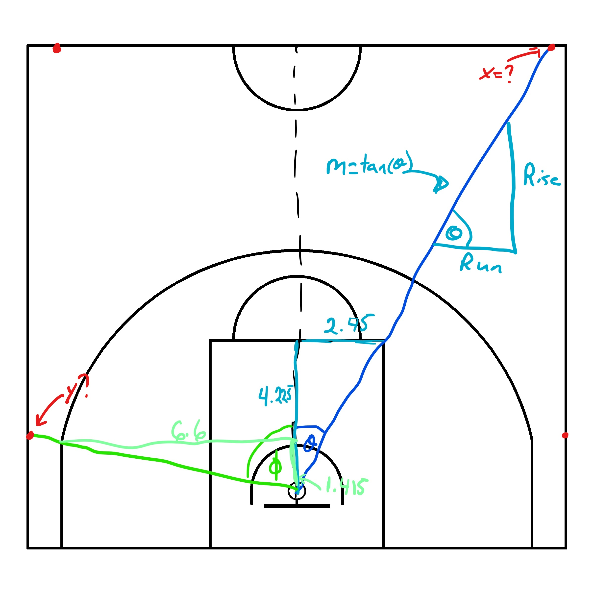

```{r setup, include=FALSE}
knitr::opts_chunk$set(echo = TRUE, message = FALSE, warning = FALSE, echo = FALSE)
```

# Dividing the Court into Zones {#zones}

__Note that all the ```R``` code used in this book is accessible on [GitHub](https://github.com/olivierchabot17/ballbook).__

There are many ways to split up a basketball court into zones. For this reasons, we will match the way that the NBA does it^[see Todd W. Schneider's [BallR](https://github.com/toddwschneider/ballr) for more info].

## Basic Zones

Let's create `sf` polygons for these zones to later conduct some spatial analysis. Creating these polygons is very similar to what we've done in Chapter \@ref(court) so we'll focus on the zones themselves instead of focusing on the [code](https://github.com/olivierchabot17/ballbook).

```{r court-basic, echo = FALSE, fig.cap = 'Basic zones for FIBA basketball court', out.width='100%', fig.align='center'}
# Load the plot_court() function from the previous chapters
source("code/court_themes.R")
source("code/fiba_court_points.R")

############################### Basic Zones ###################################
# Above the Break 3
three_ext <- st_crop(
  st_sfc(st_buffer(three_center, dist = three_point_radius)),
  xmin = three_point_side_offset, ymin = three_point_side_height,
  xmax = width - three_point_side_offset, ymax = height
)
n <- dim(st_coordinates(three_ext))[1]

three_ext_flip <- tibble(
  x = st_coordinates(three_ext)[1:(n-2), 1],
  y = st_coordinates(three_ext)[1:(n-2), 2]
) %>%
  arrange(desc(x))

above_break_three <- rbind(
  c(0, three_point_side_height),
  c(0, height),
  c(width, height),
  c(width, three_point_side_height),
  c(width - three_point_side_offset, three_point_side_height),
  three_ext_flip,
  c(three_point_side_offset, three_point_side_height),
  c(0, three_point_side_height)
)

above_break_three <- st_polygon(list(as.matrix(above_break_three)))

# Left Corner 3
left_corner_three <- rbind(
  c(width - three_point_side_offset, 0),
  c(width - three_point_side_offset, three_point_side_height),
  c(width, three_point_side_height),
  c(width, 0),
  c(width - three_point_side_offset, 0)
)

left_corner_three <- st_polygon(list(left_corner_three))

# Right Corner 3
right_corner_three <- rbind(
  c(0, 0),
  c(0, three_point_side_height),
  c(three_point_side_offset, three_point_side_height),
  c(three_point_side_offset, 0),
  c(0, 0)
)

right_corner_three <- st_polygon(list(right_corner_three))

# Mid-Range
three_ext <- tibble(
  x = st_coordinates(three_ext)[1:(n-2), 1],
  y = st_coordinates(three_ext)[1:(n-2), 2]
)

mid_range <- rbind(
  c(three_point_side_offset, 0),
  c(three_point_side_offset, three_point_side_height),
  three_ext,
  c(width - three_point_side_offset, three_point_side_height),
  c(width - three_point_side_offset, 0),
  c(width/2 + key_width/2, 0),
  c(width/2 + key_width/2, key_height),
  c(width/2 - key_width/2, key_height),
  c(width/2 - key_width/2, 0),
  c(three_point_side_offset, 0)
)

mid_range <- st_polygon(list(as.matrix(mid_range)))

# Restricted Area
ra_ext <- rbind(
  ra_ext,
  c(width/2 - restricted_area_radius - line_thick, backboard_offset)
)

restricted_area <- st_polygon(list(as.matrix(ra_ext)))

# In The Paint (Non-RA)
key_ext <- st_polygon(list(key_ext))

paint <- st_difference(key_ext, restricted_area)

basic_polys <- st_sf(
  description = c(
    "Above Break 3", 
    "Left Corner 3", 
    "Right Corner 3",
    "Mid-Range", 
    "Restricted Area", 
    "In The Paint (Non-RA)"
  ), 
  geom = c(
    st_geometry(above_break_three),
    st_geometry(left_corner_three),
    st_geometry(right_corner_three),
    st_geometry(mid_range),
    st_geometry(restricted_area),
    st_geometry(paint)
  )
) %>%
  transmute(
    shot_zone_basic = description,
    geom
  )

plot_court() +
  geom_sf(data = basic_polys,  
          aes(fill = shot_zone_basic),
          alpha = 0.2) +
  scale_fill_discrete(name = "Basic Zone")
```

As you can see from the picture above, the basic zones are mutually exclusive and cover the entirety of the half-court. Thus, each shot could be assigned a basic zone using the `st_join()` function from the `sf` package. From there, it is easy to calculate summary statistics for each zone.

## Point Value

We can also create polygons for the two areas with different point values.

```{r court-point, echo = FALSE, fig.cap = 'Point-value zones for FIBA basketball court', out.width='100%', fig.align='center'}
############################## Point Value ##################################
half_court <- st_polygon(list(half_court_int))

two_point_area <- rbind(
  c(three_point_side_offset, 0),
  c(three_point_side_offset, three_point_side_height),
  three_ext,
  c(width - three_point_side_offset, three_point_side_height),
  c(width - three_point_side_offset, 0),
  c(three_point_side_offset, 0)
)

two_point_area <- st_polygon(list(as.matrix(two_point_area)))

three_point_area <- st_difference(half_court, two_point_area)

point_polys <- st_sf(
  description = c("Two-Point Area", "Three-Point Area"), 
  geom = c(st_geometry(two_point_area), st_geometry(three_point_area))
) %>%
  transmute(
    area_value = description,
    geom
  )

plot_court() +
  geom_sf(data = point_polys,  
          aes(fill = area_value),
          alpha = 0.2) +
  scale_fill_discrete(name = "Point Value")
```

This is useful since the three-point and two-point shot attempts are considered for the __field goal percentage__^[check out this extensive [glossary](https://www.basketball-reference.com/about/glossary.html) of basketball statistics]. Knowing the point-value of each shot is crucial to calculate the __effective field goal percentage__ which adjusts for the fact that a 3-point field goal is worth one more point than a 2-point field goal.

## Shot Distance

Next, we can separate the court into zones based on distance.

```{r court-range, echo = FALSE, fig.cap = 'Distance zones for FIBA basketball court', out.width='100%', fig.align='center'}
################################ Distance ###################################
# 0-8 ft
zero_eight_ft <- hoop_center %>%
  st_buffer(dist = 8 * 0.3048)

zero_eight_ft <- st_polygon(list(st_coordinates(zero_eight_ft)[ , 1:2]))

zero_eight_ft <- st_intersection(half_court, zero_eight_ft)

# 8-16 ft
eight_sixteen_ft <- hoop_center %>%
  st_buffer(dist = 16 * 0.3048)

eight_sixteen_ft <- st_polygon(list(st_coordinates(eight_sixteen_ft)[ , 1:2]))

eight_sixteen_ft <- st_intersection(half_court, eight_sixteen_ft)

eight_sixteen_ft <- st_difference(eight_sixteen_ft, zero_eight_ft)

# 16-24 ft
sixteen_twentyfour_ft <- st_difference(
  two_point_area,
  st_union(zero_eight_ft, eight_sixteen_ft)
)

# 24+ ft
twentyfour_plus_ft <- three_point_area

distance_polys <- st_sf(
  description = c(
    "0-8 ft",
    "8-16 ft",
    "16-24 ft",
    "24+ ft"
  ), 
  geom = c(
    st_geometry(zero_eight_ft),
    st_geometry(eight_sixteen_ft),
    st_geometry(sixteen_twentyfour_ft),
    st_geometry(twentyfour_plus_ft)
  )
) %>%
  transmute(
    shot_zone_range = factor(
      description,
      levels = c("0-8 ft", "8-16 ft", "16-24 ft","24+ ft")
      ),
    geom
  )

plot_court() +
  geom_sf(data = distance_polys,  
          aes(fill = shot_zone_range),
          alpha = 0.2) +
  scale_fill_discrete(name = "Distance Zone")
```
We know that the distance from the hoop has a significant effect on the probability of making a shot. Being able to easily bin your shots by distance is crucial.

## Shot Angle

Lastly, we can split the court by angle. We want to have the following zones:

* Left Side
* Left Center
* Center
* Right Center
* Right Side

There are many ways to separate the court into these 5 zones based on angle. We need to choose two arbitrary lines that go through the center of the hoop. Let's pick the lines that pass the __exterior corner of the top key__^[blue line in Figure \@ref(fig:court-lines)] and the __top exterior point of the straight part of the three-point line__^[green line in Figure \@ref(fig:court-lines)]. 

```{r court-lines, echo = FALSE, fig.cap = 'Choice of arbitrary lines to divide the court by angle', out.width='100%', fig.align='center'}

```

```{r}
theta_1_rad <- atan((key_width/2) / (key_height - hoop_center_y))
theta_1_deg <- theta_1_rad * (180/pi)

theta_2_rad <- atan((width/2 - three_point_side_offset) / (three_point_side_height - hoop_center_y))
theta_2_deg <- theta_2_rad * (180/pi)

# Left Side
b2 <- three_point_side_height - tan(pi/2 - theta_2_rad) * (width - three_point_side_offset)
y2 <- tan(pi/2 - theta_2_rad) * width + b2
```

Finding the $(x, ~y)$ coordinates of the red dots in Figure \@ref(fig:court-lines) can be challenging. We can calculate $\theta$ and $\phi$ by using SOH CAH TOA. Since we have the measures for the adjacent and opposite sides of each angles, we will use the tangent trigonometric ratio (TOA). We get that $\theta = \arctan{\frac{O}{A}} \approx `r round(theta_1_deg)`^{\circ}$ and $\phi \approx `r round(theta_2_deg)`^{\circ}$. 

We know any line has equation $y = mx + b$. We also know that the slope of a line can be represented as $tan(\theta)$ where $\theta$ is the __angle from the horizontal__. That said, we have $y = \tan{(\theta)}x + b$. We know that the center of the hoop lies on both lines so we can substitute $x$ and $y$ in each line equation with $(7.5, ~1.575)$ to solve for the y-intercepts $b$. The coordinates of the red dots can now be easily identified once we know the line equations and one of their components.

```{r court-angle, echo = FALSE, fig.cap = 'Angle zones for FIBA basketball court', out.width='100%', fig.align='center'}
################################# Angle ###################################
left_side <- rbind(
  c(width/2, 0),
  c(width/2, hoop_center_y),
  c(width, y2),
  c(width, 0),
  c(width/2, 0)
)

left_side <- st_polygon(list(left_side))

# Left Center
b1 <- key_height - tan(pi/2 - theta_1_rad) * (width/2 + key_width/2)
x1 <- (height - b1) / tan(pi/2 - theta_1_rad)

left_center <- rbind(
  c(width/2, hoop_center_y),
  c(x1, height),
  c(width, height),
  c(width, y2),
  c(width/2, hoop_center_y)
)

left_center <- st_polygon(list(left_center))

# Center
center <- rbind(
  c(width/2, hoop_center_y),
  c(width - x1, height),
  c(x1, height),
  c(width/2, hoop_center_y)
)

center <- st_polygon(list(center))

# Right Center
right_center <- rbind(
  c(width/2, hoop_center_y),
  c(0, y2),
  c(0, height),
  c(width - x1, height),
  c(width/2, hoop_center_y)
)

right_center <- st_polygon(list(right_center))

# Left Side
right_side <- rbind(
  c(0, 0),
  c(0, y2),
  c(width/2, hoop_center_y),
  c(width/2, 0),
  c(0, 0)
)

right_side <- st_polygon(list(right_side))

angle_polys <- st_sf(
  description = c(
    "Left Side",
    "Left Center",
    "Center",
    "Right Center",
    "Right Side"
  ), 
  geom = c(
    st_geometry(left_side),
    st_geometry(left_center),
    st_geometry(center),
    st_geometry(right_center),
    st_geometry(right_side)
  )
) %>%
  transmute(
    shot_zone_area = factor(
      description,
      levels = c("Left Side", "Left Center", "Center", 
                 "Right Center","Right Side")
      ),
    geom
  )

plot_court() +
  geom_sf(data = angle_polys,  
          aes(fill = shot_zone_area),
          alpha = 0.2) +
  scale_fill_discrete(name = "Angle Zone")
```

We will see in the next chapter how we can use these zone polygons to create an augmented spatial basketball shots data set.

__Note that all the ```R``` code used in this book is accessible on [GitHub](https://github.com/olivierchabot17/ballbook).__


